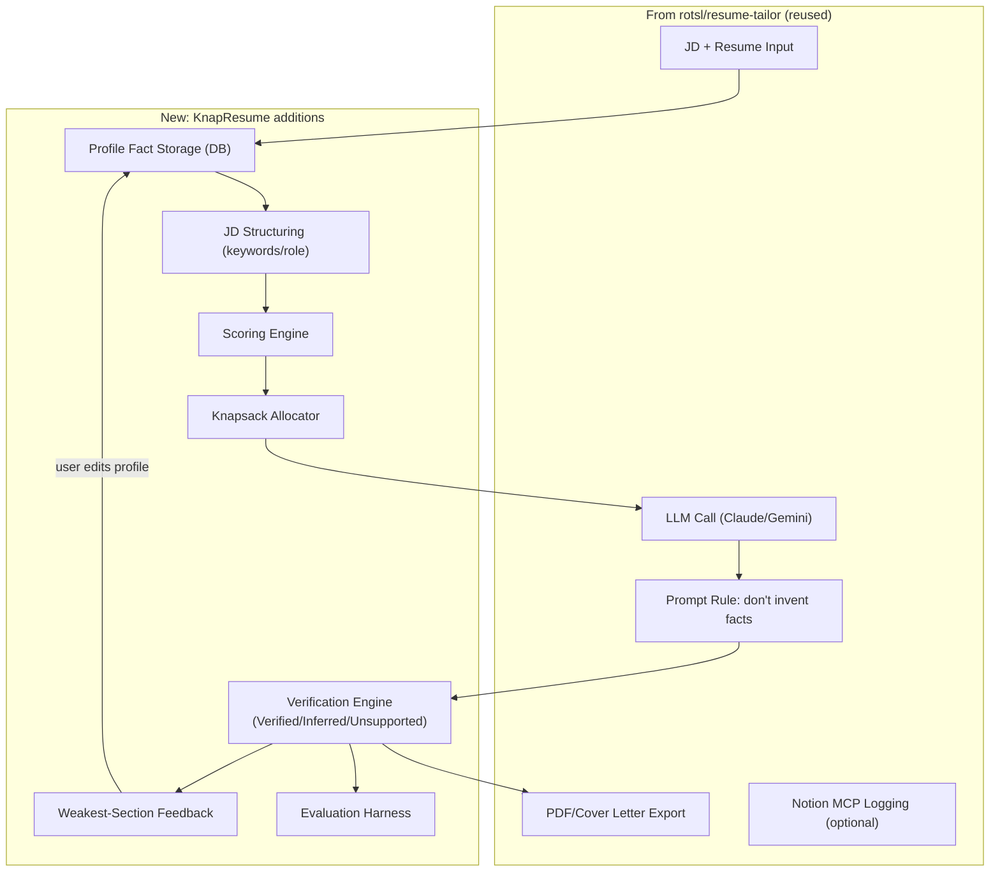
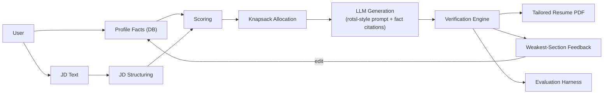
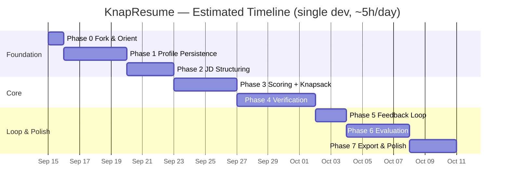
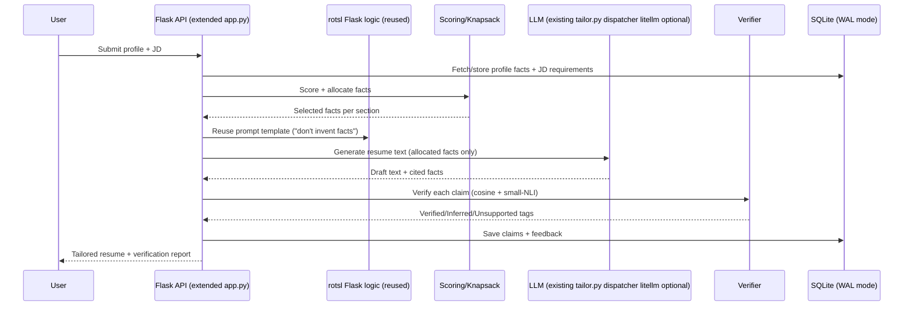

# KnapResume — Features, Tech Stack & Build Plan
### (Built on top of `rotsl/resume-tailor` fork)

---

## 1. Architecture Overview (Mermaid)

---

## 2. Feature List

### 2.1 Reused from rotsl/resume-tailor
- JD + resume text input
- LLM-based resume rewriting/reordering
- Dual LLM provider support (Claude / Gemini)
- "Only use info already present" prompt-level anti-fabrication rule
- Cover letter generation
- PDF export
- Browser-only mode (no backend) and local Flask mode
- Optional Notion MCP logging of past runs

### 2.2 New — Core Differentiators
- Persistent, reusable profile (facts stored once, reused across JDs)
- JD structuring into keywords, role type, required vs. nice-to-have skills
- Semantic + keyword scoring of facts against JD requirements
- Knapsack-based content allocation (real 0/1 DP, capacity-constrained per section)
- Three-state claim verification: **Verified / Inferred / Unsupported**
- Unsupported claims blocked from output (not just discouraged via prompt)
- Weakest-section detection with concrete reasoning (e.g. "3/8 required keywords unmatched")
- Iterative feedback loop (edit profile → re-run → improved report)
- Evaluation harness: fixed JD/profile test set, before/after metrics

### 2.3 New — Supporting Features
- Manual fact override/edit
- Single-format resume upload (DOCX) → auto-populate profile
- Section confidence/coverage scoring
- Provider-agnostic LLM layer (litellm) — Anthropic / OpenAI / Gemini
- ATS keyword checklist (lightweight, not full engine)

### 2.4 Explicitly Deferred (Module-2 / later)
- GitHub project mining
- Multi-format/arbitrary-layout resume parsing
- Full ATS compliance engine
- Diff view between tailored resume versions
- Multi-run side-by-side comparison

---

## 3. Tech Stack

### 3.1 Kept from rotsl
- Python backend
- Flask (local mode)
- ReportLab / jsPDF / PDF.js (PDF handling)
- pdfplumber (resume text extraction)
- Notion MCP client (optional — keep or replace with own DB)

### 3.2 Added for KnapResume (verified — see `TechStack_Verification.md`)
- **API framework:** keep Flask (no FastAPI — 3 endpoints, existing `threading.Thread` job model suffices)
- **Database:** SQLite + SQLAlchemy + Alembic, with **WAL mode enabled** (`PRAGMA journal_mode=WAL`) at engine setup
- **JD/text processing:** KeyBERT (drop spaCy — sentence-transformers covers role classification)
- **Semantic scoring:** sentence-transformers (`all-MiniLM-L6-v2`)
- **Fuzzy matching:** rapidfuzz
- **Knapsack allocation:** plain Python DP (no external library)
- **Verification:** embedding cosine pre-screen + small NLI cross-encoder (`cross-encoder/nli-MiniLM2-L6-H768`, ~90MB) on borderline claims
- **LLM abstraction:** litellm only if OpenAI support is required — existing `_call_ai()` dispatcher (`src/tailor.py:164`) already covers Claude/Gemini
- **PDF export:** keep rotsl's existing ReportLab path (no WeasyPrint)
- **Eval reporting:** pandas, matplotlib
- **Testing:** pytest

---

## 4. Data Flow (Mermaid)

---

## 5. Phase-Wise Build Plan

### Phase 0 — Fork & Orient  (_1 day_)
- Fork `rotsl/resume-tailor`
- Run existing app locally, confirm current flow works end-to-end
- Read `app.py` / `main.py` and `instruct.md` prompt logic
- Map existing code to which new phases will touch it
- **Timeline notes:** starts immediately; the only blocking predecessor. DoD is "can run `python app.py` and get a tailored PDF".

### Phase 1 — Profile Persistence Layer  (_4 days_)
- Add SQLAlchemy models: `Profile`, `ProfileFact`
- Add Alembic migrations
- Enable SQLite **WAL mode** (`PRAGMA journal_mode=WAL`, one line at engine setup) — prevents `database is locked` under concurrent Flask worker threads
- Build endpoints: create profile, add/edit fact, list facts
- Wire DOCX upload (python-docx) → auto-populate facts
- **DoD:** profile facts persist across runs instead of being pasted each time
- **Timeline notes:** Day 1 models + migration, Day 2 WAL setup + CRUD endpoints, Day 3 DOCX upload wiring, Day 4 integration + tests.

### Phase 2 — JD Structuring  (_3 days_)
- Add JD parsing step: boilerplate/bias filtering, keyword extraction (KeyBERT only — spaCy dropped per verification)
- Add role-type classification (embedding similarity vs. fixed taxonomy)
- Store as `JD` + `JDRequirement` records
- **DoD:** JD input produces structured `{required_skills, nice_to_have, role_type}`
- **Timeline notes:** Day 1 boilerplate filter + KeyBERT keywords, Day 2 role taxonomy + embedding classification, Day 3 records + persistence + tests.

### Phase 3 — Scoring & Knapsack Allocation  (_4 days_)
- Add embedding-based fact-to-requirement scoring
- Implement 0/1 knapsack DP allocator (per section, capacity = target length)
- Insert allocation step **before** rotsl's existing LLM call — LLM now only rewrites the allocated subset, not the full resume
- **DoD:** allocator output is provably optimal on a small test case (unit test)
- **Timeline notes:** Day 1 scoring module (reuses `all-MiniLM-L6-v2`), Day 2 DP allocator + optimality unit tests, Day 3 wire allocator output into `tailor_resume()` call, Day 4 edge cases (empty sections, capacity zero) + tests.

### Phase 4 — Verification Layer (highest priority)  (_5 days_)
- Keep rotsl's existing "don't invent facts" prompt rule as first line of defense
- Add post-generation verification: embedding similarity check against cited facts
- Tag every generated claim: Verified / Inferred / Unsupported
- Block Unsupported claims from final output
- Optionally swap direct Anthropic/Gemini SDK calls for litellm abstraction (only if OpenAI support is required)
- **DoD:** adversarial test case (forced fabrication attempt) is caught and blocked
- **Timeline notes:** Day 1 cosine verifier + claim extractor, Day 2 small-NLI entailment (`nli-MiniLM2-L6-H768`) on borderline claims, Day 3 three-state tagging + blocking, Day 4 adversarial test suite, Day 5 litellm swap only if needed.

### Phase 5 — Feedback Loop  (_2 days_)
- Compute weakest section from allocation scores
- Generate reasoning string (keyword set difference)
- Add re-run endpoint after profile edit
- **DoD:** editing a fact and re-running visibly changes the feedback report
- **Timeline notes:** Day 1 weakest-section computation + reasoning string, Day 2 re-run endpoint + visible-change test.

### Phase 6 — Evaluation Harness  (_4 days_)
- Build 10–15 fixture JD/profile pairs
- Metrics: keyword coverage before/after, verification-state distribution, allocation sensitivity
- Run comparison: original rotsl prompt-only approach vs. new verification layer
- **DoD:** results table/chart showing measurable improvement
- **Timeline notes:** Day 1 fixture set, Day 2 metric collection, Day 3 prompt-only vs. verified comparison run, Day 4 charts (matplotlib) + summary in README.

### Phase 7 — Export & Polish  (_3 days_)
- Keep rotsl's ReportLab PDF export (no WeasyPrint — C-dependency savings per verification)
- Decide: keep Notion MCP logging or replace with own `RESUME_RUN` DB table
- Add lightweight ATS keyword checklist
- **DoD:** full path works: profile → JD → allocation → generation → verification → PDF
- **Timeline notes:** Day 1 ATS keyword checklist, Day 2 Notion vs. `RESUME_RUN` decision + wiring, Day 3 full-path smoke test + final polish.

---

## 5.1 Timeline & Milestones

**Assumptions:** single developer, ~5 focused hours/day. Phases build sequentially (each depends on the previous). Estimated total: **26 working days ≈ 5.5 weeks**; at a reduced cadence (2-3 days/week) expect ~8-9 calendar weeks.

| Phase | Duration | Milestone (DoD) | Exit check |
|---|---|---|---|
| 0 — Fork & Orient | 1 day | Existing app runs end-to-end | `python app.py` → tailored PDF |
| 1 — Profile Persistence | 4 days | Facts persist across runs | Restart server → profiles still load |
| 2 — JD Structuring | 3 days | Structured JD output | `{required_skills, nice_to_have, role_type}` |
| 3 — Scoring & Knapsack | 4 days | Optimal allocator | Unit test proves DP optimality |
| 4 — Verification | 5 days | Fabrication blocked | Adversarial test passes |
| 5 — Feedback Loop | 2 days | Feedback changes after edit | Re-run diff visible |
| 6 — Evaluation | 4 days | Measurable improvement | Results table + chart |
| 7 — Export & Polish | 3 days | Full path works | Profile → JD → alloc → gen → verify → PDF |

**Total: 26 working days.** Highest-risk item is Phase 4 (verification accuracy) — it is intentionally scheduled longest and should run its adversarial suite before Phase 5/6 depend on it.

---

## 6. Sequence Diagram — End-to-End Run (Mermaid)

---

## 7. Summary Table — Before (rotsl) vs. After (KnapResume)

| Capability | rotsl/resume-tailor | KnapResume |
|---|---|---|
| Profile reuse | ✗ (paste each run) | ✓ persistent facts |
| JD structuring | ✗ (raw text to prompt) | ✓ structured keywords/role |
| Content selection | LLM implicit | ✓ knapsack DP, explicit & optimal |
| Anti-fabrication | Prompt rule only | ✓ enforced 3-state verification |
| Iteration/feedback | ✗ one-shot | ✓ weakest-section + re-run loop |
| Evaluation | ✗ | ✓ fixed test set + metrics |
| LLM provider | Claude/Gemini (direct) | ✓ provider-agnostic (litellm — optional; existing dispatcher covers Claude/Gemini) |
