# KnapResume — System Design Document

> **Document status:** Approved
> **Last updated:** 2026-09-15
> **Owner:** HitkarMiglani
> **Reviewers:** HM

---

## 1. Overview

- **Problem statement:** As a 4th-year CSE student applying to multiple roles daily, tailoring a resume per JD takes 45-60 min of manual work — rewriting content, matching keywords, checking ATS compatibility, and reformatting. Doing this for 2-3 roles per day alongside regular activities is unsustainable.
- **Proposed solution:** KnapResume is a CLI + local web tool that takes a user's profile of facts and a JD, then uses a knapsack-based content allocator + LLM rewriting + three-state verification to produce a tailored, ATS-optimized resume in under 60 seconds — with iterative feedback so the user can edit their profile and re-run until satisfied.
- **Primary users:** Students and early-career professionals applying to multiple job roles simultaneously.
- **Success metric:** Average time from JD input to tailored, verified resume PDF drops from 45-60 min to under 60 sec, with 3+ required keywords matched per section.

---

## 2. Goals & Non-Goals

### Goals

| # | Goal | Measurable target |
|---|---|---|
| G1 | Persistent, reusable profile | Profile facts persist across runs (SQLite-backed) |
| G2 | JD structuring | JD produces structured `{required_skills, nice_to_have, role_type}` |
| G3 | Optimal content selection | Knapsack DP allocator selects best facts per section |
| G4 | Anti-fabrication enforcement | 3-state verification: Verified / Inferred / Unsupported |
| G5 | Iterative feedback | Weakest-section detection with concrete reasoning |
| G6 | End-to-end resume | Full path: profile -> JD -> allocation -> generation -> verification -> PDF |
| G7 | Free-tier cost | Runs within free tiers of LLM providers |
| G8 | Generation speed | Resume generated in under 60 seconds (build + validate + improve) |

### Non-Goals

| # | Non-Goal | Why excluded |
|---|---|---|
| NG1 | Multi-user / multi-tenant system | Personal tool; no auth needed |
| NG2 | Self-improving / learning system | Static rules; no feedback loops that modify the system itself |
| NG3 | Full ATS compliance engine | Out of scope; only lightweight keyword checklist |
| NG4 | GitHub project mining | Deferred to Module 2 |
| NG5 | Multi-format resume parsing | Only DOCX upload supported initially |
| NG6 | Real-time collaboration | Single-user tool |
| NG7 | Cloud-hosted SaaS | Runs locally (Flask + CLI) |

---

## 3. Requirements

### 3.1 Functional Requirements

| ID | Requirement | Priority | Testable via |
|---|---|---|---|
| FR1 | The system SHALL persist profile facts across runs using SQLite | Must | Restart server -> profile still loads |
| FR2 | The system SHALL extract keywords and role type from a JD | Must | Structured JD output: `{required_skills, nice_to_have, role_type}` |
| FR3 | The system SHALL score profile facts against JD requirements | Must | Cosine similarity scores > 0 for relevant facts |
| FR4 | The system SHALL select optimal fact subset per section using knapsack DP | Must | Unit test proves DP optimality on small test case |
| FR5 | The system SHALL tag every generated claim as Verified / Inferred / Unsupported | Must | Adversarial test case passes |
| FR6 | The system SHALL block Unsupported claims from final output | Must | Output contains no Unsupported claims |
| FR7 | The system SHALL generate tailored resume + cover letter PDFs | Must | PDF files are generated and downloadable |
| FR8 | The system SHALL detect weakest section with reasoning | Should | Feedback string shows keyword gap |
| FR9 | The system SHALL support re-run after profile edit | Should | Re-run shows visibly different output |
| FR10 | The system SHALL auto-populate profile from DOCX upload | Could | Upload DOCX -> profile facts extracted |
| FR11 | The system SHALL log runs to Notion (optional) | Could | Notion database shows new entry |
| FR12 | The system SHALL provide ATS keyword checklist | Could | Checklist shows matched/unmatched keywords |

### 3.2 Non-Functional Requirements

| Category | Requirement | Target |
|---|---|---|
| Latency | End-to-end resume generation time | Under 60 seconds |
| Throughput | Concurrent requests | 1 user, 1 request at a time (threading for background jobs) |
| Availability | Local tool availability | Runs when `python app.py` is started |
| Scalability | User count | 1 (personal tool) |
| Security | API keys | Never logged, stored in `.env` only |
| Cost | LLM provider spend | Free tier (Claude / Gemini) |
| Durability | Profile data | Survives server restart (SQLite file) |
| Size | Install footprint | Under 1GB total (verified: ~615MB after stack optimization) |

### 3.3 Constraints

| Constraint | Impact on design |
|---|---|
| Single developer, part-time | 26 working days (~5.5 weeks full focus) |
| Free-tier LLM only | No complex prompt chains that burn tokens; one LLM call per resume + cover letter |
| Local-only deployment | SQLite is sufficient; no need for Postgres/Redis |
| Fork of `rotsl/resume-tailor` | Must extend existing Flask app.py / tailor.py, not rewrite |
| Python-only backend | All new modules in Python; no separate services |

---

## 4. Context & System Boundaries

### 4.1 Context Diagram

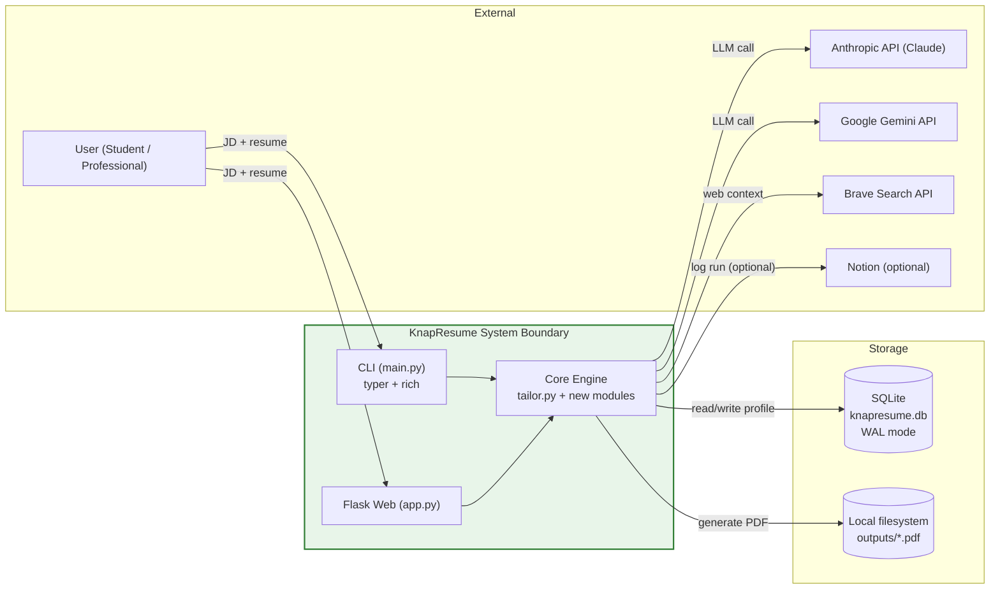

### 4.2 Boundaries

| Boundary | What is inside | What is outside |
|---|---|---|
| System boundary | Flask API, CLI, Core Engine (scoring, allocation, verification) | LLM APIs, Notion, Brave Search, filesystem |
| Trust boundary | API keys never leave the process | LLM providers see prompts (which may contain resume data) |
| Data ownership | Profile facts, JD records, run logs, generated PDFs | Notion logs (external, optional) |

### 4.3 External Dependencies

| Dependency | Purpose | SLA / Reliability | Failure handling |
|---|---|---|---|
| Anthropic Claude | LLM generation | Cloud provider SLA | Fallback to Gemini or error message |
| Google Gemini | LLM generation | Cloud provider SLA | Fallback to Claude or error message |
| Brave Search | Company context enrichment | Public API, no SLA | Skip web context, proceed with JD only |
| Notion MCP | Optional run logging | No SLA (optional) | Catch and ignore errors, resume continues |

---

## 5. Architecture & Components

### 5.1 High-Level Architecture

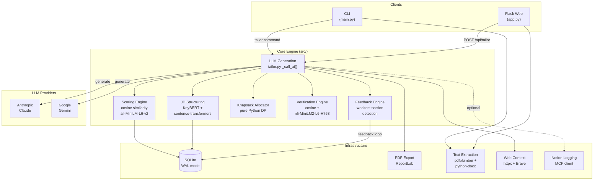

### 5.2 Component Responsibilities

| Component | Type | Responsibility | Interfaces (in) | Interfaces (out) | Failure mode |
|---|---|---|---|---|---|
| `app.py` (Flask) | Web server | Serves web UI, accepts JD/resume input, returns PDF | HTTP POST | JSON + PDF download | Returns 500 on unhandled errors |
| `main.py` (CLI) | CLI entry | Interactive/command-line input for JD + resume | CLI args | PDF files | Exits with error message |
| `parser.py` | Module | Extracts text from PDF, DOCX, TXT files | File bytes/path | Plain text string | Raises ValueError on unsupported format |
| `tailor.py` | Module | LLM prompt construction + provider dispatch | Resume, JD, web_context | Tailored resume text | Raises ValueError on missing API key |
| `web_context.py` | Module | Fetches company context via Brave Search | JD text, URL | Context string | Returns empty string on failure |
| `pdf_generator.py` | Module | Converts text to ATS-friendly PDF via ReportLab | Resume text | PDF file path | Raises on malformed text |
| `notion_integration.py` | Module | Logs job applications to Notion via MCP | Job title, company | Notion page ID | Catches and logs errors, continues |
| `jd_structuring` (new) | Module | KeyBERT keyword extraction + role classification | JD text | `{required_skills, nice_to_have, role_type}` | Raises on empty JD |
| `scoring` (new) | Module | Embedding-based fact-to-requirement cosine similarity | Facts, requirements | Scored facts | Returns empty scores on failure |
| `allocator` (new) | Module | 0/1 knapsack DP allocator, capacity per section | Scored facts, capacity | Selected facts per section | Falls back to full input if allocation fails |
| `verifier` (new) | Module | Cosine pre-screen + NLI entailment on borderline claims | Generated claims, cited facts | Verified/Inferred/Unsupported tags | Defaults to "Unsupported" on model failure |
| `feedback` (new) | Module | Weakest-section detection with keyword gap reasoning | Allocation scores | Feedback string | Returns empty feedback on failure |

### 5.3 Layered Architecture

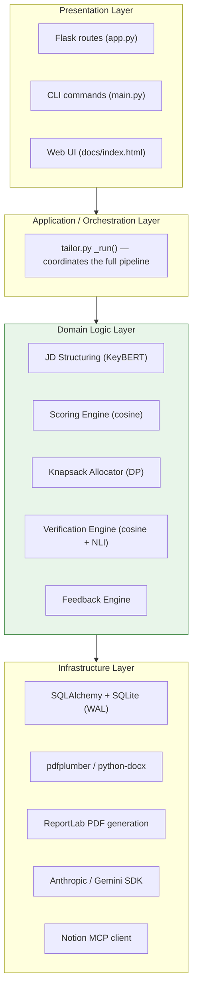

**Dependency rule:** Arrows point downward. Domain logic (green) has no knowledge of Flask, CLI, or database specifics.

---

## 6. Data Model & Storage

### 6.1 Storage Choice & Rationale

| Choice | Type | Why chosen | Alternatives rejected | When to reconsider |
|---|---|---|---|---|
| SQLite | File-based relational | Zero config, single file, WAL mode handles concurrent reads, SQLAlchemy ORM works identically | PostgreSQL (overkill for single-user, requires server process) | Multi-user support, concurrent writes from multiple processes |

**Data volume estimate:**
- Profile facts: ~10-50 per user
- JD records: ~5-20 per user per month
- Run logs: ~20-50 per user per month
- Total: **hundreds of rows, not thousands**

### 6.2 Entity-Relationship Diagram

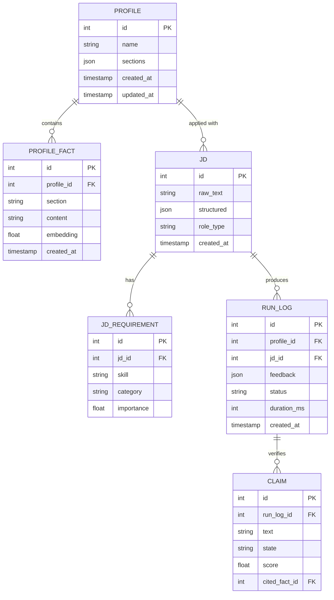

### 6.3 Table Definitions

```
Table: profiles
  id              (PK, INTEGER, auto-increment)
  name            (TEXT, NOT NULL)
  sections        (JSON — {"summary": "...", "experience": [...], ...})
  created_at      (TIMESTAMP, default CURRENT_TIMESTAMP)
  updated_at      (TIMESTAMP, default CURRENT_TIMESTAMP)

Table: profile_facts
  id              (PK, INTEGER, auto-increment)
  profile_id      (INTEGER, FK -> profiles.id, NOT NULL)
  section         (TEXT, NOT NULL — e.g. "experience", "education", "skills")
  content         (TEXT, NOT NULL — the fact string)
  embedding       (BLOB — pickled numpy array, 384-dim float32)
  created_at      (TIMESTAMP, default CURRENT_TIMESTAMP)
  Index: idx_profile_facts_profile_id ON profile_facts(profile_id)

Table: jds
  id              (PK, INTEGER, auto-increment)
  raw_text        (TEXT, NOT NULL — full JD text)
  structured      (JSON — {"required_skills": [...], "nice_to_have": [...]})
  role_type       (TEXT — e.g. "backend", "data", "frontend", "devops")
  created_at      (TIMESTAMP, default CURRENT_TIMESTAMP)

Table: jd_requirements
  id              (PK, INTEGER, auto-increment)
  jd_id           (INTEGER, FK -> jds.id, NOT NULL)
  skill           (TEXT, NOT NULL — e.g. "Python", "React", "SQL")
  category        (TEXT — "required" or "nice_to_have")
  importance      (FLOAT, 0.0-1.0)
  Index: idx_jd_requirements_jd_id ON jd_requirements(jd_id)

Table: run_logs
  id              (PK, INTEGER, auto-increment)
  profile_id      (INTEGER, FK -> profiles.id, NOT NULL)
  jd_id           (INTEGER, FK -> jds.id, NOT NULL)
  feedback        (JSON — {"weakest_section": "...", "reasoning": "...", "matched_keywords": [...]})
  status          (TEXT — "pending" / "completed" / "failed")
  duration_ms     (INTEGER)
  created_at      (TIMESTAMP, default CURRENT_TIMESTAMP)

Table: claims
  id              (PK, INTEGER, auto-increment)
  run_log_id      (INTEGER, FK -> run_logs.id, NOT NULL)
  text            (TEXT, NOT NULL — the generated claim)
  state           (TEXT, NOT NULL — "verified" / "inferred" / "unsupported")
  score           (FLOAT — cosine similarity or NLI entailment score)
  cited_fact_id   (INTEGER, FK -> profile_facts.id, NULLABLE)
  Index: idx_claims_run_log_id ON claims(run_log_id)
```

### 6.4 Data Lifecycle

| Phase | Action | Retention | Tool |
|---|---|---|---|
| Active | Profile facts, JD records, run logs in SQLite | Indefinite (local tool) | SQLAlchemy |
| Archived | Old run logs older than 6 months | Optional cleanup script | Alembic migration |
| Deleted | User manually deletes profile or run | Manual or CLI command | CRUD endpoint |

### 6.5 Migrations & Consistency

- **Migration tool:** Alembic (run `alembic revision --autogenerate -m "description"`)
- **Consistency model:** Strong (single-user, no concurrent writes from multiple processes)
- **Schema evolution strategy:** Expand-then-contract (add new columns/tables first, migrate data, drop old columns later)
- **WAL mode setup** (required at engine connection):

```python
from sqlalchemy import event, create_engine

engine = create_engine("sqlite:///knapresume.db", connect_args={"check_same_thread": False})

@event.listens_for(engine, "connect")
def _set_sqlite_pragma(dbapi_connection, connection_record):
    cursor = dbapi_connection.cursor()
    cursor.execute("PRAGMA journal_mode=WAL")
    cursor.execute("PRAGMA busy_timeout=5000")
    cursor.close()
```

---

## 7. Key Design Decisions (ADR Style)

### ADR-001: SQLite over PostgreSQL

- **Status:** Accepted
- **Date:** 2026-09-15
- **Context:** KnapResume is a personal tool with one user, hundreds of rows of data. PostgreSQL was proposed in the original build plan.
- **Decision:** Use SQLite with WAL mode, keeping the same SQLAlchemy + Alembic ORM stack.
- **Alternatives considered:**
  | Alternative | Pros | Cons |
  |---|---|---|
  | PostgreSQL | Full-text search, JSONB, production-grade | Requires server process, deployment overhead for single-user tool |
  | SQLite | Zero config, single file, same ORM | No ARRAY/JSONB, single-writer |
- **Rationale:** Hundreds of rows don't need a database server. SQLAlchemy models and Alembic migrations work identically with SQLite. WAL mode handles concurrent reads from Flask worker threads.
- **Consequences:** Single-writer limitation (acceptable for single-user). No full-text search (use LIKE queries or rapidfuzz).
- **Revisit trigger:** Adding multi-user support or concurrent writes from multiple processes.

### ADR-002: Keep Flask over FastAPI

- **Status:** Accepted
- **Date:** 2026-09-15
- **Context:** FastAPI was proposed for its async/WebSocket capabilities.
- **Decision:** Keep the existing Flask server with `threading.Thread` for background jobs.
- **Alternatives considered:**
  | Alternative | Pros | Cons |
  |---|---|---|
  | FastAPI | Native async, WebSocket, auto OpenAPI | New framework, dual web framework, 3 endpoints don't need it |
  | Flask | Already working, 132 lines, threading.Thread for jobs | No native WebSocket |
- **Rationale:** 3 endpoints with threading.Thread background jobs and `/api/status` polling is sufficient. FastAPI only wins for WebSocket streaming, which this tool doesn't need.
- **Consequences:** No real-time progress (use polling). No auto-generated OpenAPI docs.
- **Revisit trigger:** Adding a frontend that needs real-time WebSocket streaming.

### ADR-003: Drop spaCy, keep KeyBERT

- **Status:** Accepted
- **Date:** 2026-09-15
- **Context:** spaCy (`en_core_web_sm`) was proposed for JD text processing alongside KeyBERT.
- **Decision:** Use KeyBERT only for keyword extraction; sentence-transformers for role classification.
- **Alternatives considered:**
  | Alternative | Pros | Cons |
  |---|---|---|
  | spaCy + KeyBERT | Full NER pipeline | 15MB model, dependency parsing not needed |
  | KeyBERT only | Lightweight, purpose-built | No NER (regex handles company names) |
- **Rationale:** spaCy's value is NER and dependency parsing — neither is needed for JD structuring. KeyBERT handles keyword extraction. Role classification uses sentence-transformers embeddings (already in the stack). Saves ~15MB.
- **Consequences:** Company name extraction relies on regex (already working in `app.py:92-95`).
- **Revisit trigger:** Need for complex NLP tasks beyond keyword extraction.

### ADR-004: Small NLI cross-encoder for verification

- **Status:** Accepted
- **Date:** 2026-09-15
- **Context:** The full NLI model (`nli-deberta-v3-base`, ~500MB) was proposed for verification.
- **Decision:** Use `nli-MiniLM2-L6-H768` (~90MB) as a second opinion on borderline claims.
- **Alternatives considered:**
  | Alternative | Pros | Cons |
  |---|---|---|
  | Full NLI (deberta-v3) | Highest accuracy | ~500MB download, minutes to first run |
  | Small NLI (MiniLM2) | ~90MB, same architecture, preserves 3-state | Slightly lower accuracy on paraphrase edge cases |
  | Cosine only | Zero additional models | Collapses Verified/Inferred to two states |
- **Rationale:** Hybrid flow: cosine pre-screen (fast, already needed for scoring) -> NLI only on borderline claims (0.60 < score < 0.85). Preserves the three-state Verified/Inferred/Unsupported design.
- **Consequences:** ~90MB model download on first run. Borderline claims get a principled second opinion.
- **Revisit trigger:** If the small NLI model underperforms on paraphrase edge cases, upgrade to a larger cross-encoder.

### ADR-005: Keep ReportLab over WeasyPrint

- **Status:** Accepted
- **Date:** 2026-09-15
- **Context:** WeasyPrint was proposed for HTML/CSS-to-PDF templating.
- **Decision:** Keep the existing ReportLab path (392 working lines in `pdf_generator.py`).
- **Alternatives considered:**
  | Alternative | Pros | Cons |
  |---|---|---|
  | ReportLab | Already working, pure Python, no C deps | Flowable-based layout is less flexible |
  | WeasyPrint | HTML/CSS templating | Requires C libs (cairo, pango), 200MB+ install |
- **Rationale:** ReportLab handles all resume parsing (section headers, bullets, job entries, contact blocks). WeasyPrint only wins for complex multi-column HTML/CSS layouts — resume templates don't need this.
- **Consequences:** Resume templates limited to ReportLab's flowable system.
- **Revisit trigger:** Need for pixel-perfect resume templates with complex multi-column layouts.

---

## 8. API & Interface Design

### 8.1 API Overview

| Method | Endpoint | Purpose | Auth required |
|---|---|---|---|
| POST | `/api/tailor` | Start resume tailoring job (form data) | API key in form |
| GET | `/api/status/<job_id>` | Poll job status and progress | No |
| GET | `/api/download/<job_id>/<doc>` | Download generated PDF (resume or cover) | No |
| POST | `/api/profile` | Create or update profile | API key |
| GET | `/api/profile/<id>/facts` | List profile facts | No |
| POST | `/api/profile/<id>/facts` | Add fact to profile | No |
| PUT | `/api/fact/<id>` | Edit a fact | No |
| DELETE | `/api/fact/<id>` | Delete a fact | No |

### 8.2 Request / Response Examples

**Start tailoring job**

```
POST /api/tailor
Content-Type: multipart/form-data

provider: claude
model: claude-opus-4-5
api_key: sk-ant-...
job_text: "We are looking for a Backend Engineer with Python, SQL..."
resume_text: "John Doe | Software Engineer..."
```

```json
// 200 OK
{
  "job_id": "a1b2c3d4-e5f6-7890-abcd-ef1234567890"
}
```

**Poll job status**

```
GET /api/status/a1b2c3d4-e5f6-7890-abcd-ef1234567890
```

```json
// 200 OK (in progress)
{
  "job_id": "a1b2c3d4-e5f6-7890-abcd-ef1234567890",
  "status": "running",
  "step": 2,
  "progress": "Scoring facts against JD requirements"
}

// 200 OK (complete)
{
  "job_id": "a1b2c3d4-e5f6-7890-abcd-ef1234567890",
  "status": "done",
  "step": 6,
  "resume_path": "outputs/a1b2_resume.pdf",
  "cover_path": "outputs/a1b2_cover.pdf",
  "company": "Acme Corp",
  "job_title": "Backend Engineer",
  "notion_saved": false
}

// 404 Not Found
{
  "error": "Job not found"
}

// 200 OK (failed)
{
  "job_id": "a1b2c3d4-e5f6-7890-abcd-ef1234567890",
  "status": "error",
  "error": "Could not extract text from uploaded file."
}
```

**Download PDF**

```
GET /api/download/a1b2c3d4-e5f6-7890-abcd-ef1234567890/resume
```

Returns: PDF file as `application/pdf` attachment named `Resume_Acme_Corp.pdf`

### 8.3 Versioning & Pagination

- **Versioning strategy:** No versioning needed (single-user tool, no public API)
- **Pagination:** Not applicable (profile facts are small in number)
- **Rate limiting:** Not applicable (single-user, local-only)

### 8.4 Error Handling

| HTTP status | Meaning | Retryable? | Client action |
|---|---|---|---|
| 400 | Bad request (missing fields) | No | Fix request parameters |
| 404 | Job or resource not found | No | Verify job_id or resource ID |
| 413 | File too large (over 16MB) | No | Upload smaller file |
| 422 | Validation failed (empty JD/resume) | No | Provide non-empty JD and resume |
| 500 | Server error | Yes | Retry; check server logs |

### 8.5 Internal Contracts (service-to-service)

- **Transport:** Direct Python function calls (no inter-service communication)
- **Schema:** All modules accept/return plain Python types (str, dict, list)
- **LLM dispatch:** `_call_ai(system, user, provider, model, api_key)` -> str
- **Verification:** `verify_claims(claims, facts)` -> list[dict] with `{text, state, score}`

---

## 9. Concurrency & Performance

### 9.1 Concurrency Model

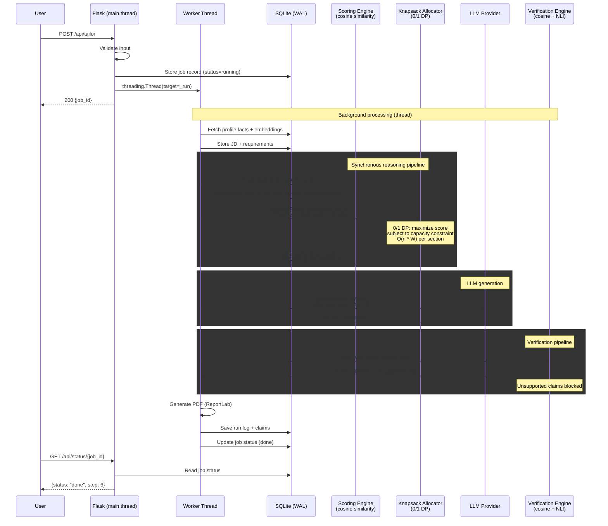

**Key concurrency note:** The entire pipeline (scoring -> knapsack -> LLM -> verification -> PDF) runs synchronously within a single worker thread. The knapsack allocator is a pure CPU-bound DP computation (`O(n * W)` per section where `n` = number of facts, `W` = section capacity) — it completes in milliseconds for typical profile sizes (10-50 facts) and does not need parallelism. The only async boundary is the LLM API call (30-55s), which the worker thread blocks on. Flask's main thread remains free to serve `/api/status` polling requests.

### 9.2 Performance Budget

| Metric | p50 target | p95 target | p99 target | Measurement |
|---|---|---|---|---|
| JD structuring (KeyBERT) | 0.5s | 1s | 2s | Keyword extraction + role classification |
| Scoring (cosine similarity) | 0.3s | 0.5s | 1s | Embedding cosine per fact-requirement pair |
| **Knapsack allocation (DP)** | **0.01s** | **0.05s** | **0.1s** | **0/1 DP O(n * W), n=50 facts, W=8 sections** |
| LLM generation | 30s | 45s | 55s | LLM provider response time |
| Verification (cosine + NLI) | 2s | 4s | 6s | Cosine pre-screen + NLI on borderline claims |
| PDF generation | 1s | 2s | 3s | ReportLab build time |
| **Total end-to-end** | **35s** | **52s** | **64s** | **Wall clock from POST to done** |

### 9.3 Caching Strategy

| Cache layer | What is cached | TTL / invalidation | Max size |
|---|---|---|---|
| Sentence-transformer model | Model weights in memory | Process lifetime (loaded once) | ~80MB RAM |
| NLI model | Entailment model in memory | Process lifetime (loaded once) | ~90MB RAM |
| KeyBERT model | Keyword model in memory | Process lifetime (loaded once) | ~50MB RAM |
| Embeddings | Profile fact embeddings in DB | Recomputed when fact changes | Unbounded (one per fact) |

### 9.4 Bottleneck Analysis

```
Request flow: 1 user -> 1 request -> JD structuring -> scoring -> knapsack -> LLM -> verification -> PDF
Bottleneck at: LLM API response time (30-55s) — 90%+ of total wall time
Mitigation: Worker thread + status polling (user sees progress, not blocked)
Second bottleneck: Model loading on cold start (~10-15s first request)
Mitigation: Load models at app startup, not per-request
Knapsack: NOT a bottleneck — pure CPU, O(n*W), completes in <50ms for n=50, W=8
JD structuring: NOT a bottleneck — KeyBERT inference, <1s for typical JD
```

---

## 10. Security & Privacy

### 10.1 Authentication & Authorization

| Concern | Mechanism | Details |
|---|---|---|
| API key for LLM | Passed in form data or env var | Never logged; stored in `.env` only |
| Notion API key | Environment variable | `NOTION_API_KEY` in `.env` |
| Web UI access | None (local-only) | Flask binds to `0.0.0.0:5000`, accessible only on localhost/LAN |
| CLI access | OS user | No additional auth (runs as local user) |

### 10.2 Data Classification

| Data class | Examples | Handling rule | Encryption |
|---|---|---|---|
| Public | None | | |
| Internal | Profile facts, JD text | Stored in local SQLite, never uploaded | Not encrypted (local file) |
| Confidential | API keys (Claude, Gemini) | `.env` file, never committed to git | Not encrypted (local file) |
| Sensitive (user content) | Resume text, tailored output | Processed in-memory, stored as local PDF | Not encrypted (local file) |

### 10.3 Threat Model (STRIDE)

| Threat | Component at risk | Current mitigation | Residual risk | Action needed |
|---|---|---|---|---|
| Spoofing | LLM API calls | API key authentication | Low (local tool) | None |
| Tampering | SQLite database | Local file, no network access | Low (local tool) | None |
| Repudiation | Run logs | Notion logging (optional) | Low (local tool) | None |
| Info Disclosure | Resume data to LLM | Prompt-level anti-fabrication rule + verification | Medium (LLM provider sees data) | Add data minimization in prompts |
| Denial of Service | Flask server | Single-user, no external input validation needed | Low | None |
| Elevation of Privilege | Local filesystem | Runs as local user | Low (local tool) | None |

### 10.4 Secret Management

| Secret type | Storage location | Rotation schedule | Access scope |
|---|---|---|---|
| Anthropic API key | `.env` file | Manual | `tailor.py` |
| Gemini API key | `.env` file | Manual | `tailor.py` |
| Notion API key | `.env` file | Manual | `notion_integration.py` |
| Brave Search key | `.env` file | Manual | `web_context.py` |

---

## 11. Reliability, Resilience & Failure Modes

### 11.1 Failure Mode Analysis

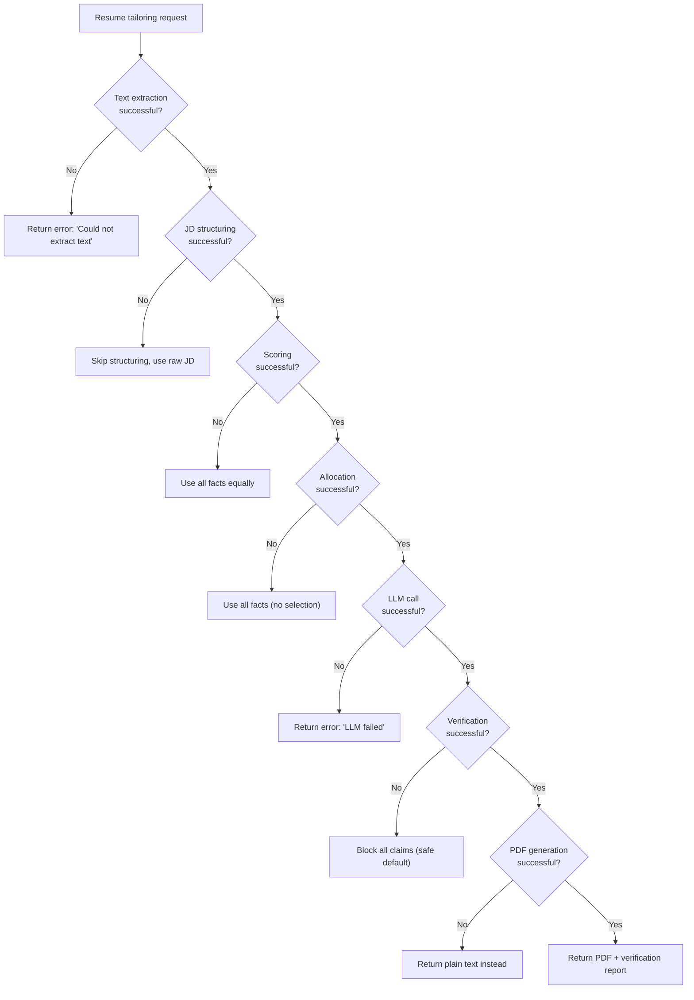

### 11.2 Failure Modes per Component

| Component | Failure type | Detection | Recovery | User impact |
|---|---|---|---|---|
| LLM Provider | Timeout / rate limit | HTTP exception | Retry once, then fail with error message | Resume not generated |
| LLM Provider | Empty response | Check `message.content[0].text` | Retry once, then fail | Resume not generated |
| SQLite | Database locked | `sqlite3.OperationalError` | WAL mode + busy_timeout=5000ms | Retry automatically |
| SQLite | Corruption | SQLAlchemy exception | Backup + recreate from scratch | Data loss |
| KeyBERT | Empty JD text | Check input length | Skip JD structuring, use raw text | Lower quality resume |
| NLI Model | Model not downloaded | `ImportError` on first call | Fall back to cosine-only (2 states) | Inferred state lost |
| ReportLab | Malformed text input | `ReportLab Exception` | Return plain text file | PDF not generated |
| Notion MCP | Connection failure | `RuntimeError` from MCP client | Catch and ignore, continue | Notion log not saved |

### 11.3 Circuit Breakers & Timeouts

| Call | Timeout | Max retries | Backoff | Circuit breaker |
|---|---|---|---|---|
| Anthropic Claude | 60s | 1 | None (single retry) | No (single user) |
| Google Gemini | 60s | 1 | None | No |
| Brave Search | 10s | 0 | N/A | No |
| Notion MCP | 15s | 0 | N/A | No |

### 11.4 Backup & Recovery

| Data store | Backup frequency | RTO | RPO | Recovery procedure |
|---|---|---|---|---|
| SQLite (knapresume.db) | On demand (copy file) | Instant | Last backup | Copy file back, or recreate from scratch |
| Output PDFs | Not backed up (regenerable) | Minutes | N/A | Re-run tailoring |
| `.env` keys | User's responsibility | Minutes | N/A | Re-enter keys |

---

## 12. Deployment & Operations

### 12.1 Deployment Topology

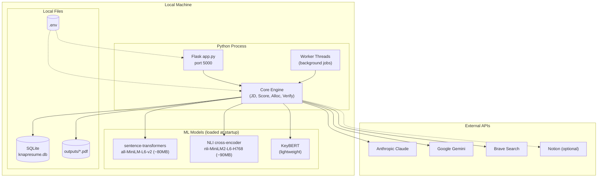

### 12.2 CI/CD Pipeline

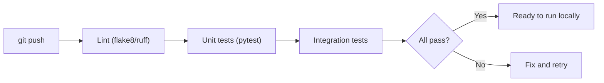

**Note:** No deployment pipeline — runs locally via `python app.py` (web) or `python main.py` (CLI). GitHub Pages hosts the browser-only frontend (`docs/index.html`).

### 12.3 Configuration Management

| Config type | Source | How updated | Secret? |
|---|---|---|---|
| LLM API keys | `.env` file | Manual edit | Yes |
| Notion API key | `.env` file | Manual edit | Yes |
| Brave Search key | `.env` file | Manual edit | Yes |
| Provider selection | CLI args / form data | Per request | No |
| Model selection | CLI args / form data | Per request | No |
| Output directory | Hardcoded in `app.py` | Edit source | No |
| Max upload size | `app.py` config | Edit source | No |

### 12.4 Rollback Strategy

| Failure type | Rollback action | Time to rollback | Data impact |
|---|---|---|---|
| Bad code (git) | `git checkout` to previous commit | Seconds | None (code only) |
| Bad migration | `alembic downgrade` | Seconds | Data loss for migrated rows |
| Bad LLM prompt | Edit `instruct.md` or `tailor.py` prompts | Seconds | None (prompts only) |
| Corrupted DB | Delete `knapresume.db`, restart | Seconds | All data lost (recreate profiles) |

### 12.5 Cost Estimate

| Resource | Specification | Monthly cost | Scaling trigger |
|---|---|---|---|
| Local compute | Developer machine (existing) | $0 | N/A |
| Anthropic Claude | Free tier (limited calls) | $0 | Exceed free tier |
| Google Gemini | Free tier (limited calls) | $0 | Exceed free tier |
| Brave Search | Free tier (2000 queries/month) | $0 | Exceed free tier |
| Notion | Free tier (个人版) | $0 | Exceed free tier |
| **Total** | | **$0** | |

---

## 13. Observability

### 13.1 Telemetry Stack

| Pillar | Tool | What to capture | Retention |
|---|---|---|---|
| Logs | Python `logging` / `rich` | Request flow, errors, timing | Console (no persistence) |
| Metrics | In-memory counters in `app.py` | Job count, success/fail rate, duration | Process lifetime |
| Traces | Not applicable (single-process) | N/A | N/A |
| Alerts | Not applicable (local tool) | N/A | N/A |

### 13.2 Key Metrics (RED + USE Method)

**RED (per request):**
| Metric | Description | What to watch |
|---|---|---|
| Rate | Requests per minute | Spike indicates batch processing |
| Errors | Failed jobs / total jobs | >10% indicates systemic issue |
| Duration | End-to-end time per job | >60s indicates LLM latency or model loading |

**USE (per resource):**
| Resource | Utilization | Saturation | Errors |
|---|---|---|---|
| CPU | Model inference + LLM wait | Multiple concurrent jobs | None expected |
| Memory | ~300MB for all models | >1GB = investigate | None expected |
| Disk (SQLite) | WAL file growth | >100MB = compact | `database is locked` |
| Network | LLM API calls | Timeouts | HTTP 429/500 |

### 13.3 Business Metrics

| Metric | What it means | Collection method | Dashboard |
|---|---|---|---|
| Jobs completed | How many resumes generated | Counter in `app.py` | Console log |
| Verification distribution | % Verified / Inferred / Unsupported | `claims` table query | Manual SQL query |
| Average score | Mean cosine similarity of claims | `claims` table query | Manual SQL query |
| Weakest sections | Most common gap areas | `run_logs.feedback` query | Manual SQL query |

### 13.4 Alerting Rules

| Alert | Condition | Severity | Action | Runbook link |
|---|---|---|---|---|
| LLM failure rate > 50% | 3+ consecutive job failures | High | Check API key, rate limits | Check `.env` and provider dashboard |
| SQLite locked errors | `OperationalError` in logs | Medium | Verify WAL mode is enabled | Check `_set_sqlite_pragma` is called |
| Model loading > 30s | First request slow | Low | Wait for model to load (expected) | None (cold start) |

---

## 14. Scalability Plan

### 14.1 Load Progression

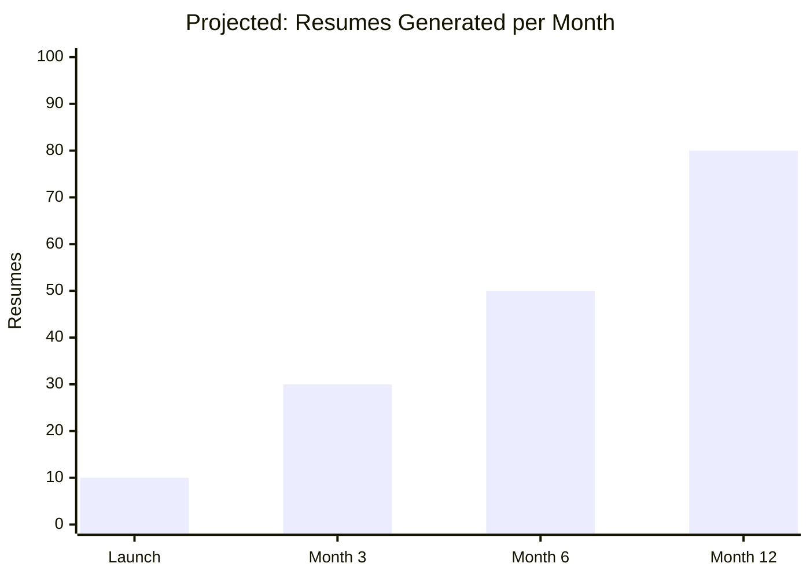

### 14.2 Scaling Strategy

| Scale dimension | Current capacity | Threshold to trigger | Scaling action |
|---|---|---|---|
| Single user | 1 user, 1 request at a time | >1 concurrent user | Add multi-user auth (deferred) |
| LLM throughput | 1 LLM call per resume | >100 resumes/day | Switch to paid tier or add rate limiting |
| Model loading | ~300MB RAM at startup | >1GB total | Unload unused models, use lazy loading |
| Data volume | Hundreds of rows | >10,000 rows | Archive old run logs |
| Database | Single SQLite file | >1GB file size | Migrate to PostgreSQL |

### 14.3 Scaling Limits

| Component | Hard limit | Mitigation when reached |
|---|---|---|
| SQLite single-writer | 1 concurrent write | Add connection pooling or migrate to Postgres |
| LLM API rate limit | Provider-specific | Queue requests, add backoff |
| Local disk | OS limits | Archive old outputs, compress PDFs |
| Model RAM | ~300MB per model | Load models lazily, unload when idle |

---

## 15. Testing Strategy

### 15.1 Testing Pyramid

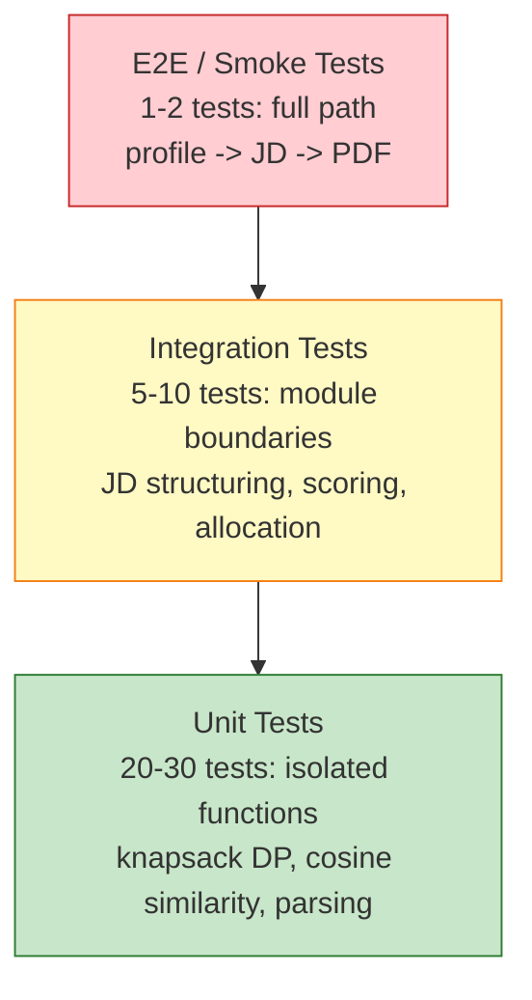

### 15.2 Test Coverage by Layer

| Layer | Framework | What is tested | What is mocked | Coverage target |
|---|---|---|---|---|
| Unit | pytest | Knapsack DP optimality, cosine similarity thresholds, text parsing, JD structuring | LLM calls, DB | 80%+ |
| Integration | pytest | Scoring -> allocation pipeline, verification flow, feedback generation | LLM calls (use fixture responses) | 70%+ |
| E2E / Smoke | pytest | Full path: input -> PDF output | None (uses real LLM if API key available) | 100% pass before release |
| Adversarial | pytest | Forced fabrication attempt is caught and blocked | None (uses real LLM) | Must pass |

### 15.3 Test Gates (CI/CD)

| Gate | Runs on | Pass criteria | Blocks local run? |
|---|---|---|---|
| Lint (ruff/flake8) | Every commit | 0 errors | Yes |
| Unit tests | Every commit | 100% pass | Yes |
| Integration tests | PR merge | 100% pass | Yes |
| Coverage | PR merge | >= 80% unit, >= 70% integration | Warning |
| Adversarial test | Pre-release | Must pass | Yes |
| E2E smoke | Pre-release | Must pass | Yes |

---

## 16. Open Questions & Risks

### Open Questions

| # | Question | Impact if unresolved | Needs decision by | Owner |
|---|---|---|---|---|
| 1 | Should Notion logging be kept or replaced with `RESUME_RUN` DB table? | Dual data store if not decided | Phase 7 | Author |
| 2 | Is litellm needed or is existing `_call_ai()` sufficient? | Extra dependency if added unnecessarily | Phase 4 | Author |
| 3 | What cosine threshold (0.60-0.85) works best for borderline claims? | Verification quality depends on tuning | Phase 4 | Author |

### Risks & Mitigations

| # | Risk | Likelihood | Impact | Mitigation | Owner |
|---|---|---|---|---|---|
| 1 | Verification accuracy too low (too many false Unsupported) | Medium | High (user trust) | Tune thresholds, add NLI fallback | Author |
| 2 | LLM free tier rate limits hit during heavy use | Medium | Medium (delayed generation) | Queue requests, fallback to second provider | Author |
| 3 | SQLite concurrency errors under rapid re-runs | Low | Medium (lost writes) | WAL mode + busy_timeout=5000ms | Author |
| 4 | Model loading time too slow on first request | Low | Low (cold start only) | Load models at app startup, not per-request | Author |
| 5 | DOCX parsing fails on non-standard formats | Medium | Low (user error) | Clear error message, support TXT fallback | Author |

---

## 17. Timeline / Milestones

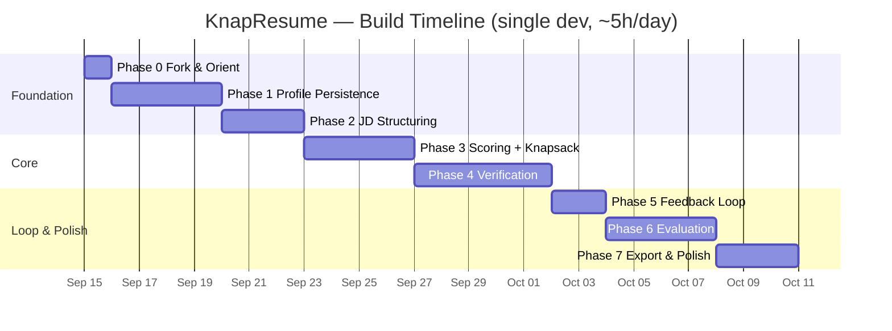

### Milestone Table

| Milestone | Scope | Target date | Exit criteria | Dependencies |
|---|---|---|---|---|
| M0 | Fork + run existing app | 2026-09-15 | `python app.py` -> tailored PDF | None |
| M1 | Profile facts persist across runs | 2026-09-19 | Restart server -> profiles load | M0 |
| M2 | Structured JD output | 2026-09-22 | `{required_skills, nice_to_have, role_type}` | M1 |
| M3 | Optimal knapsack allocator | 2026-09-26 | Unit test proves DP optimality | M2 |
| M4 | 3-state verification blocks fabrication | 2026-10-01 | Adversarial test passes | M3 |
| M5 | Feedback changes after profile edit | 2026-10-03 | Re-run shows different output | M4 |
| M6 | Measurable improvement over baseline | 2026-10-07 | Results table + chart | M5 |
| M7 | Full path works end-to-end | 2026-10-10 | Profile -> JD -> alloc -> gen -> verify -> PDF | M6 |

**Total: 26 working days.** Highest-risk item is M4 (verification accuracy) — intentionally scheduled longest.

---

## 18. Alternative Designs Considered

### Alternative A: FastAPI + PostgreSQL

| Aspect | Assessment |
|---|---|
| Description | Modern async API framework + production database |
| Pros | Native async, auto OpenAPI docs, production-grade DB |
| Cons | New framework, dual web framework, server process for Postgres, overkill for single-user |
| Why rejected | 3 endpoints don't need async; SQLite handles hundreds of rows; no multi-user requirement |
| Revisit if | Adding a frontend with WebSocket streaming or multi-user support |

### Alternative B: spaCy + full NLI cross-encoder

| Aspect | Assessment |
|---|---|
| Description | Full NLP pipeline (spaCy NER + KeyBERT) + large NLI model (deberta-v3) |
| Pros | Highest NLP quality, strongest verification accuracy |
| Cons | ~515MB extra downloads, longer first-run, dependency conflicts, spaCy NER not needed |
| Why rejected | spaCy NER not needed for JD structuring; large NLI only marginally better than small NLI |
| Revisit if | Need for complex NER or verification accuracy proves insufficient with small NLI |

### Alternative C: WeasyPrint for PDF export

| Aspect | Assessment |
|---|---|
| Description | HTML/CSS-to-PDF templating for resume layout |
| Pros | Pixel-perfect templates, CSS flexibility |
| Cons | Requires C libraries (cairo, pango), ~200MB install, 392 working lines in ReportLab |
| Why rejected | Resume templates don't need HTML/CSS complexity; ReportLab already handles all parsing |
| Revisit if | Need for pixel-perfect multi-column resume layouts |

### Comparison Matrix

| Criterion (weighted) | Current design | Alt A: FastAPI + Postgres | Alt B: spaCy + full NLI | Alt C: WeasyPrint |
|---|---|---|---|---|
| Install size | **Small (~615MB)** | Large (~900MB) | Large (~1.1GB) | Large (~815MB) |
| Setup complexity | **Minimal (local file)** | High (server process) | Medium | High (C deps) |
| Verification quality | **Good (small NLI)** | Good (small NLI) | Best (deberta-v3) | Good (small NLI) |
| PDF flexibility | **Adequate (ReportLab)** | Adequate (ReportLab) | Adequate (ReportLab) | Best (HTML/CSS) |
| Time to implement | **Baseline** | +3-5 days (new framework) | +2-3 days (spaCy setup) | +1-2 days (C dep issues) |
| **Weighted total** | **Best** | Third | Second | Fourth |

---

## 19. References & Appendices

### Related Documents

| Document | Link | Relationship |
|---|---|---|
| Build Plan | `KnapResume_Features_TechStack_BuildPlan.md` | Phase-wise implementation plan this design implements |
| Tech Stack Verification | `TechStack_Verification.md` | ADR rationale for stack choices |
| Existing codebase | `rotsl/resume-tailor` (fork) | Code being extended |
| Humanizer prompt | `instruct.md` | Prompt anti-AI-writing instructions loaded by tailor.py |
| Privacy policy | `docs/privacy.html` | User-facing privacy notice |

### Glossary

| Term | Definition |
|---|---|
| Profile | User's collection of facts (skills, experience, education) stored once, reused across JDs |
| JD | Job Description — the text of a job posting |
| Fact | A single piece of information in the profile (e.g. "Built a REST API in Python") |
| Knapsack allocation | 0/1 dynamic programming algorithm that selects the optimal subset of facts per resume section within a capacity constraint |
| Verified claim | A generated claim that closely matches a cited profile fact (cosine >= 0.85 or NLI entails) |
| Inferred claim | A generated claim that is plausible but not directly supported by profile facts (NLI neutral) |
| Unsupported claim | A generated claim that contradicts or cannot be verified against profile facts (blocked from output) |
| ATS | Applicant Tracking System — software used by employers to filter resumes |

### Change Log

| Version | Date | Author | Change summary |
|---|---|---|---|
| 0.1 | 2026-09-15 | Author | Initial draft — full system design from build plan |
