# System Design Document

> **Document status:** Draft / In Review / Approved
> **Last updated:** YYYY-MM-DD
> **Owner:** <name / team>
> **Reviewers:** <names>

---

## 1. Overview

> 2-4 sentences: what the system does, for whom, and why now.
> Write this last. It should be a summary of sections 2-5.

- **Problem statement:** <what pain or opportunity this addresses>
- **Proposed solution:** <one paragraph summary of what is being built>
- **Primary users:** <who uses this — include role/actor types>
- **Success metric:** <single number that proves this works>

---

## 2. Goals & Non-Goals

### Goals
Write each goal as a testable statement. Include functional and non-functional goals.

| # | Goal | Measurable target |
|---|---|---|
| G1 | | |
| G2 | | |
| G3 | | |

### Non-Goals
Explicitly state what this system will NOT do. This prevents scope creep.

| # | Non-Goal | Why excluded |
|---|---|---|
| NG1 | | |
| NG2 | | |

---

## 3. Requirements

### 3.1 Functional Requirements
Write as "The system SHALL ..." — each requirement must be independently testable.

| ID | Requirement | Priority | Testable via |
|---|---|---|---|
| FR1 | The system SHALL ... | Must | |
| FR2 | The system SHALL ... | Should | |
| FR3 | The system SHALL ... | Could | |

### 3.2 Non-Functional Requirements

| Category | Requirement | Target |
|---|---|---|
| Latency | | |
| Throughput | | |
| Availability | | |
| Scalability | | |
| Security | | |
| Durability | | |
| Cost | | |

### 3.3 Constraints
Hard constraints that shape the design (budget, team, timeline, technology mandates, compliance).

| Constraint | Impact on design |
|---|---|
| | |

---

## 4. Context & System Boundaries

### 4.1 Context Diagram

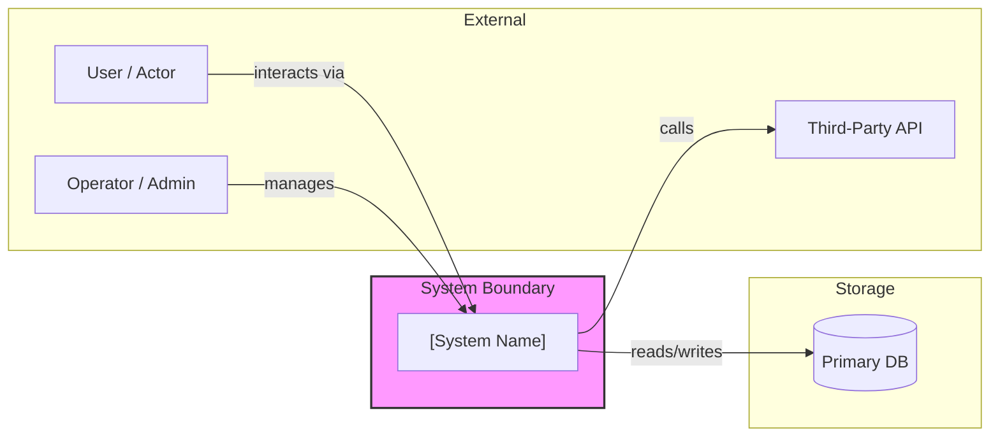

**Instructions:** Replace the boxes above with your actual actors, services, and data stores. The system should appear as a single box; its internals are expanded in Section 5.

### 4.2 Boundaries

| Boundary | What is inside | What is outside |
|---|---|---|
| System boundary | | |
| Trust boundary (auth enforced here) | | |
| Data ownership boundary | | |

### 4.3 External Dependencies

| Dependency | Purpose | SLA / Reliability | Failure handling |
|---|---|---|---|
| | | | |

---

## 5. Architecture & Components

### 5.1 High-Level Architecture

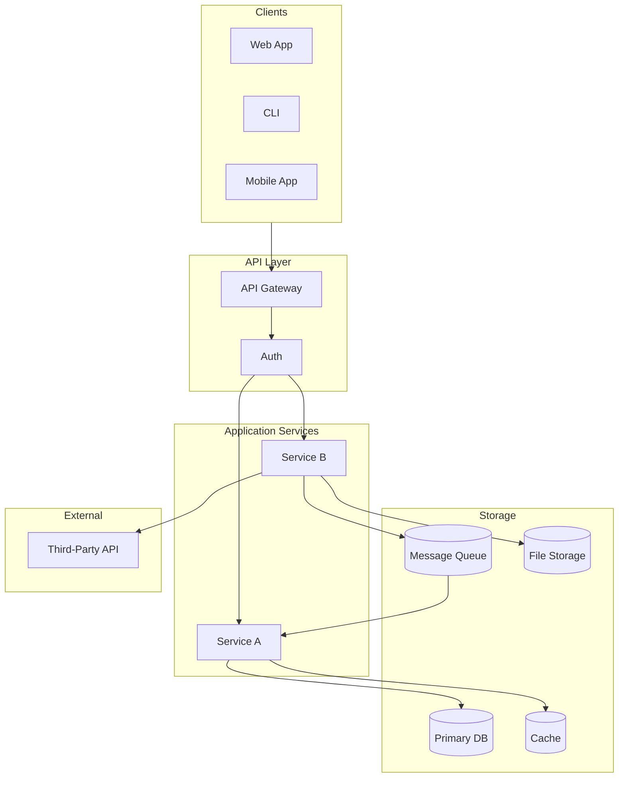

**Instructions:** Replace each box with your actual components. Remove unused boxes. Add directional arrows with labels for data flow.

### 5.2 Component Responsibilities

| Component | Type | Responsibility | Interfaces (in) | Interfaces (out) | Failure mode |
|---|---|---|---|---|---|
| | Service | | | | |
| | Database | | | | |
| | Cache | | | | |

### 5.3 Layered Architecture

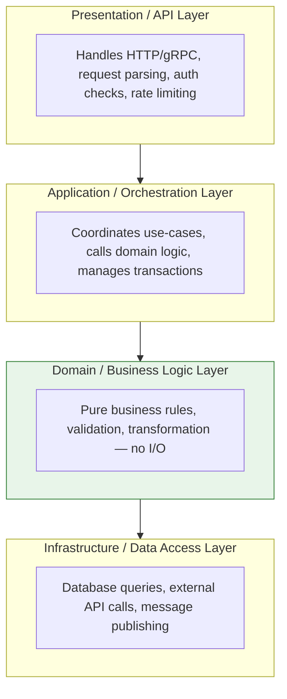

**Dependency rule:** Arrows point downward only. Domain layer (green) has no knowledge of the layers above or below it.

---

## 6. Data Model & Storage

### 6.1 Storage Choice & Rationale

| Choice | Type | Why chosen | Alternatives rejected | When to reconsider |
|---|---|---|---|---|
| | | | | |

### 6.2 Entity-Relationship Diagram

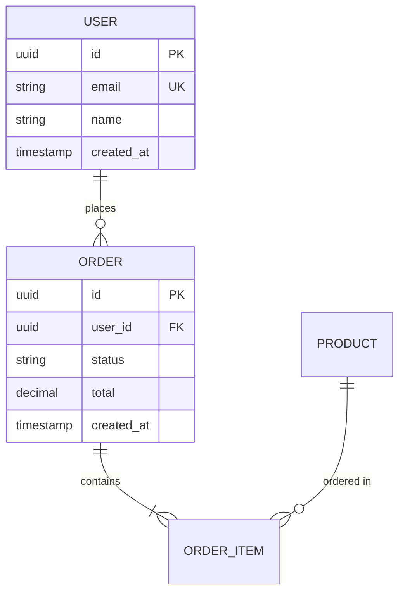

**Instructions:** Replace with your actual entities. Define types, constraints, and indexes in the table below.

### 6.3 Table Definitions

```
Table: <entity_name>
  id              (PK, UUID / BIGINT, auto-generated)
  <field>         (type, constraints, nullable?, default)
  created_at      (TIMESTAMP, default NOW)
  updated_at      (TIMESTAMP, on-update NOW)

Indexes:
  - idx_<table>_<field> ON <table>(<field>) [UNIQUE] [WHERE condition]
```

### 6.4 Data Lifecycle

| Phase | Action | Retention | Tool |
|---|---|---|---|
| Active | | | |
| Archived | | | |
| Deleted | | | |

### 6.5 Migrations & Consistency

- **Migration tool:** <Alembic / Flyway / Liquibase / manual>
- **Consistency model:** <Strong / Eventual / Saga pattern>
- **Schema evolution strategy:** <expand-then-contract / blue-green / backward-compatible only>
- **Rollback plan:** <how to undo a bad migration>

---

## 7. Key Design Decisions (ADR Style)

Each significant decision should be documented as an Architecture Decision Record:

### ADR-001: <Decision Title>

- **Status:** Proposed / Accepted / Deprecated / Superseded
- **Date:** YYYY-MM-DD
- **Context:** What is the issue that motivates this decision?
- **Decision:** What is the change being proposed or decided?
- **Alternatives considered:**
  | Alternative | Pros | Cons |
  |---|---|---|
  | Option A | | |
  | Option B | | |
- **Rationale:** Why this option over the others?
- **Consequences:** What becomes easier / harder as a result?
- **Revisit trigger:** <conditions under which this decision should be re-examined>

### Summary of all decisions

| ADR # | Decision | Status | Revisit trigger |
|---|---|---|---|
| 001 | | | |

---

## 8. API & Interface Design

### 8.1 API Overview

| Method | Endpoint | Purpose | Auth required |
|---|---|---|---|
| POST | `/api/v1/resource` | Create | Yes |
| GET | `/api/v1/resource/:id` | Read | Yes |
| PUT | `/api/v1/resource/:id` | Update | Yes |
| DELETE | `/api/v1/resource/:id` | Delete | Yes |
| GET | `/api/v1/resource` | List / Search | Yes |

### 8.2 Request / Response Examples

**Create resource**

```
POST /api/v1/resource
Content-Type: application/json
Authorization: Bearer <token>

{
  "field": "value",
  "nested": { "key": "value" }
}
```

```json
// 201 Created
{
  "id": "uuid",
  "field": "value",
  "created_at": "2026-01-15T10:30:00Z"
}
```

**Error response**

```json
// 422 Unprocessable Entity
{
  "error": {
    "code": "VALIDATION_FAILED",
    "message": "Field 'email' is required",
    "details": [{ "field": "email", "rule": "required" }]
  }
}
```

### 8.3 Versioning & Pagination

- **Versioning strategy:** <URL path / query param / header>
- **Pagination:** <cursor-based / offset-limit> with default page size
- **Rate limiting:** <X requests per Y seconds per client>

### 8.4 Error Handling

| HTTP status | Meaning | Retryable? | Client action |
|---|---|---|---|
| 400 | Bad request | No | Fix request |
| 401 | Unauthenticated | No | Re-authenticate |
| 403 | Forbidden | No | Check permissions |
| 404 | Not found | No | Verify resource ID |
| 409 | Conflict | Maybe | Fetch latest, retry |
| 422 | Validation failed | No | Fix fields per error |
| 429 | Rate limited | Yes | Backoff and retry |
| 500 | Server error | Yes | Retry with backoff |
| 503 | Service unavailable | Yes | Retry after delay |

### 8.5 Internal Contracts (service-to-service)

- **Transport:** <HTTP / gRPC / message queue>
- **Schema definition:** <Protobuf / Avro / JSON Schema>
- **Discovery:** <DNS / service registry / static config>

---

## 9. Concurrency & Performance

### 9.1 Concurrency Model

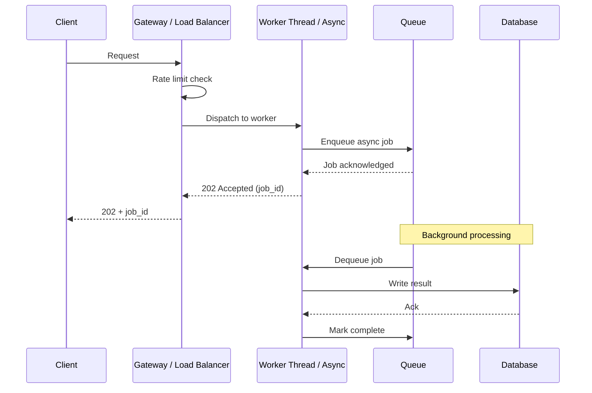

**Instructions:** Replace with your actual request/processing flow.

### 9.2 Performance Budget

| Metric | p50 target | p95 target | p99 target | Measurement method |
|---|---|---|---|---|
| API response latency | | | | |
| Background job duration | | | | |
| DB query time | | | | |

### 9.3 Caching Strategy

| Cache layer | What is cached | TTL / invalidation | Max size |
|---|---|---|---|
| | | | |

### 9.4 Bottleneck Analysis

```
Request rate: _____ req/s → ____ DB writes/s → ____ external API calls/s
Bottleneck at: _________________ (first constraint hit at scale)
Mitigation: ___________________
```

---

## 10. Security & Privacy

### 10.1 Authentication & Authorization

| Concern | Mechanism | Details |
|---|---|---|
| Authentication | | |
| Session / token model | | |
| Authorization model | | |
| API key management | | |
| Token rotation / expiry | | |

### 10.2 Data Classification

| Data class | Examples | Handling rule | Encryption |
|---|---|---|---|
| Public | | | |
| Internal | | | |
| Confidential | | | |
| Restricted (PII) | | | |

### 10.3 Threat Model (STRIDE)

| Threat | Component at risk | Current mitigation | Residual risk | Action needed |
|---|---|---|---|---|
| Spoofing | | | | |
| Tampering | | | | |
| Repudiation | | | | |
| Info Disclosure | | | | |
| Denial of Service | | | | |
| Elevation of Privilege | | | | |

### 10.4 Secret Management

| Secret type | Storage location | Rotation schedule | Access scope |
|---|---|---|---|
| API keys | | | |
| DB credentials | | | |
| Signing keys | | | |

---

## 11. Reliability, Resilience & Failure Modes

### 11.1 Failure Mode Analysis

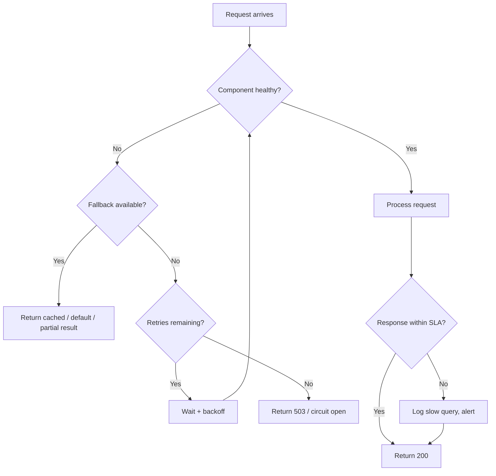

### 11.2 Failure Modes per Component

| Component | Failure type | Detection | Recovery | User impact |
|---|---|---|---|---|
| | Crash | | | |
| | Slow / timeout | | | |
| | Data corruption | | | |
| | Network partition | | | |

### 11.3 Circuit Breakers & Timeouts

| Call | Timeout | Max retries | Backoff | Circuit breaker threshold |
|---|---|---|---|---|
| | | | | |

### 11.4 Backup & Recovery

| Data store | Backup frequency | RTO | RPO | Recovery procedure |
|---|---|---|---|---|
| | | | | |

---

## 12. Deployment & Operations

### 12.1 Deployment Topology

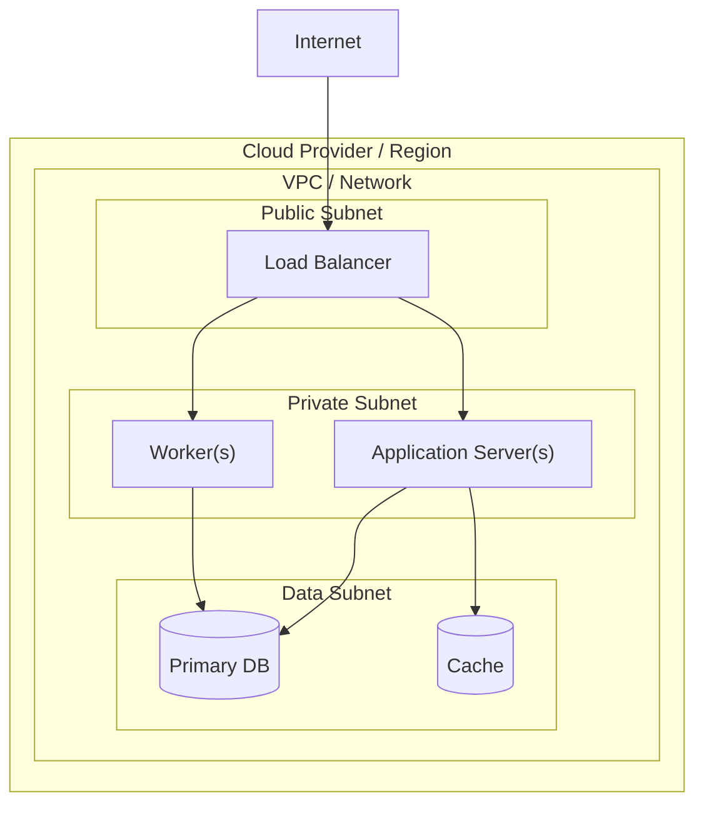

### 12.2 CI/CD Pipeline

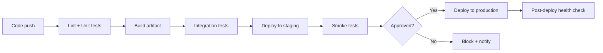

### 12.3 Configuration Management

| Config type | Source | How updated | Secret? |
|---|---|---|---|
| Feature flags | | | No |
| Environment vars | | | No |
| API keys | | | Yes |
| DB credentials | | | Yes |

### 12.4 Rollback Strategy

| Failure type | Rollback action | Time to rollback | Data impact |
|---|---|---|---|
| Bad deploy (code) | | | |
| Bad migration (schema) | | | |
| Bad config change | | | |

### 12.5 Cost Estimate

| Resource | Specification | Monthly cost | Scaling trigger |
|---|---|---|---|
| Compute | | | |
| Database | | | |
| Storage | | | |
| Network / bandwidth | | | |
| External APIs | | | |
| **Total** | | | |

---

## 13. Observability

### 13.1 Telemetry Stack

| Pillar | Tool | What to capture | Retention |
|---|---|---|---|
| Logs | | | |
| Metrics | | | |
| Traces | | | |
| Alerts | | | |

### 13.2 Key Metrics (RED + USE Method)

**RED (per endpoint / service):**
| Metric | Description | Alert threshold |
|---|---|---|
| Rate | Requests per second | |
| Errors | Error rate (%) | |
| Duration | Latency (p50/p95/p99) | |

**USE (per resource):**
| Resource | Utilization | Saturation | Errors |
|---|---|---|---|
| CPU | | | |
| Memory | | | |
| Disk | | | |
| Network | | | |
| DB connections | | | |

### 13.3 Business Metrics

| Metric | What it means | Collection method | Dashboard |
|---|---|---|---|
| | | | |

### 13.4 Alerting Rules

| Alert | Condition | Severity | Action | Runbook link |
|---|---|---|---|---|
| | | | | |

---

## 14. Scalability Plan

### 14.1 Load Progression

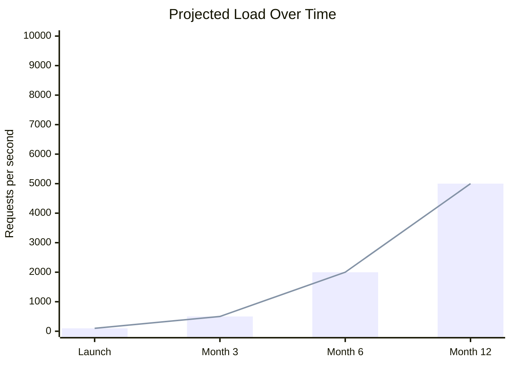

### 14.2 Scaling Strategy

| Scale dimension | Current capacity | Threshold to trigger | Scaling action |
|---|---|---|---|
| Vertical (scale up) | | | |
| Horizontal (scale out) | | | |
| Read replicas | | | |
| Sharding / partitioning | | | |
| Caching layer | | | |

### 14.3 Scaling Limits

| Component | Hard limit | Mitigation when reached |
|---|---|---|
| Single DB instance | | |
| Single compute node | | |
| Cache memory | | |
| External API rate limit | | |

---

## 15. Testing Strategy

### 15.1 Testing Pyramid

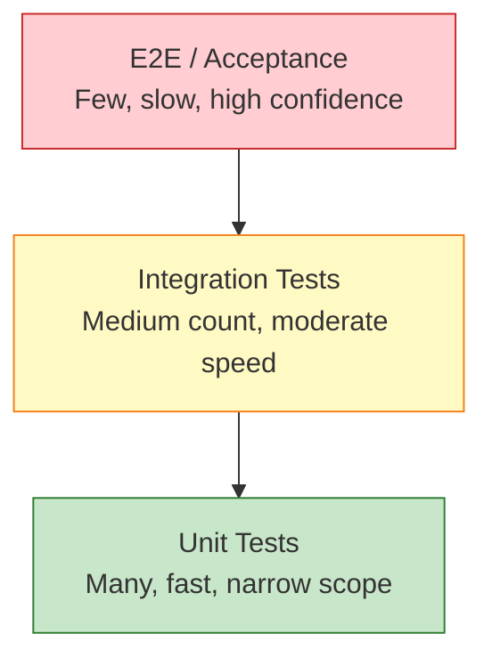

### 15.2 Test Coverage by Layer

| Layer | Framework | What is tested | What is mocked | Coverage target |
|---|---|---|---|---|
| Unit / Domain | | | | |
| Integration | | | | |
| API / Contract | | | | |
| E2E / Smoke | | | | |
| Performance / Load | | | | |
| Security / Penetration | | | | |

### 15.3 Test Gates (CI/CD)

| Gate | Runs on | Pass criteria | Blocks deployment? |
|---|---|---|---|
| Lint | Every push | 0 errors | Yes |
| Unit tests | Every push | 100% pass | Yes |
| Integration | PR merge | 100% pass | Yes |
| Coverage | PR merge | >= threshold | Yes |
| Security scan | PR merge | 0 critical | Yes |
| E2E | Pre-deploy | 100% pass | Yes |

---

## 16. Open Questions & Risks

### Open Questions

| # | Question | Impact if unresolved | Needs decision by | Owner |
|---|---|---|---|---|
| | | | | |

### Risks & Mitigations

| # | Risk | Likelihood | Impact | Mitigation | Owner |
|---|---|---|---|---|---|
| | High / Med / Low | High / Med / Low | | | |

---

## 17. Timeline / Milestones

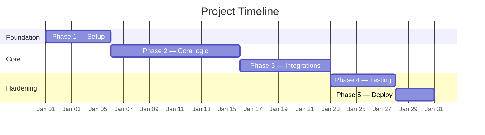

### Milestone Table

| Milestone | Scope | Target date | Exit criteria | Dependencies |
|---|---|---|---|---|
| | | | | |

---

## 18. Alternative Designs Considered

### Alternative A: <Name>

| Aspect | Assessment |
|---|---|
| Description | |
| Pros | |
| Cons | |
| Why rejected | |
| Revisit if | |

### Alternative B: <Name>

| Aspect | Assessment |
|---|---|
| Description | |
| Pros | |
| Cons | |
| Why rejected | |
| Revisit if | |

### Comparison Matrix

| Criterion (weighted) | Current design | Alternative A | Alternative B |
|---|---|---|---|
| Latency | | | |
| Cost | | | |
| Complexity | | | |
| Scalability | | | |
| Time to implement | | | |
| **Weighted total** | | | |

---

## 19. References & Appendices

### Related Documents

| Document | Link | Relationship |
|---|---|---|
| PRD | | This design implements it |
| API Docs | | Reference |
| Runbooks | | Operational guide |
| ADR Log | | Decision history |

### Glossary

| Term | Definition |
|---|---|
| | |

### Change Log

| Version | Date | Author | Change summary |
|---|---|---|---|
| 0.1 | | | Initial draft |
| 0.2 | | | |
| 1.0 | | | Approved |