# Tech Stack Verification Report

### Build Plan: KnapResume Features, Tech Stack & Build Plan
### Verified against: Existing codebase (`rotsl/resume-tailor` fork)

---

## 1. What Already Exists

The forked codebase already provides a working foundation. Before adding anything new, understand what's in place.

### 1.1 Current Architecture

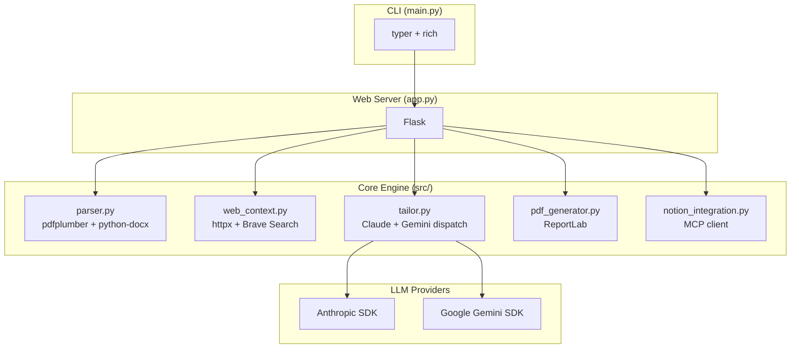

### 1.2 Existing Dependencies (requirements.txt)

| Package | Purpose | Already Working |
|---|---|---|
| `anthropic>=0.25.0` | Claude API calls | Yes — `src/tailor.py` |
| `google-generativeai>=0.8.0` | Gemini API calls | Yes — `src/tailor.py` |
| `pdfplumber>=0.10.0` | PDF text extraction | Yes — `src/parser.py` |
| `reportlab>=4.0.0` | PDF generation | Yes — `src/pdf_generator.py` |
| `python-docx>=1.1.0` | DOCX text extraction | Yes — `src/parser.py` |
| `flask>=3.0.0` | Web server | Yes — `app.py` |
| `httpx>=0.27.0` | HTTP client (URL fetch) | Yes — `src/web_context.py` |
| `mcp>=1.0.0` | Notion MCP protocol | Yes — `src/mcp_notion_client.py` |
| `notion-client>=2.2.0` | Notion SDK | Yes — `src/notion_integration.py` |
| `typer>=0.12.0` | CLI framework | Yes — `main.py` |
| `rich>=13.7.0` | CLI formatting | Yes — `main.py` |
| `python-dotenv>=1.0.0` | Env var loading | Yes |

### 1.3 Existing LLM Abstraction

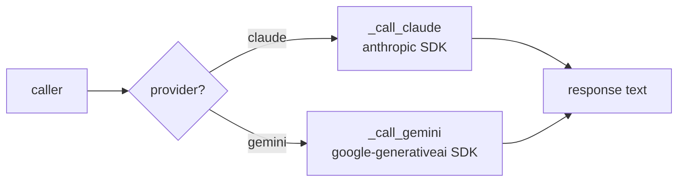

**Key finding:** The codebase already has a clean provider dispatcher at `src/tailor.py:164-177`. The `_call_ai()` function routes based on `provider` string, accepts `model` and `api_key` at call time, and returns plain text. This is a lightweight abstraction layer.

---

## 2. Proposed vs. Recommended Tech Stack

### 2.1 Component-by-Component Verdict

| Component | Plan Proposes | Recommended | Verdict |
|---|---|---|---|
| API framework | FastAPI | Flask (keep existing) | **DROP** |
| Database | PostgreSQL + SQLAlchemy + Alembic | SQLite + SQLAlchemy + Alembic | **DOWNGRADE** |
| NLP pipeline | spaCy (`en_core_web_sm`) + KeyBERT | KeyBERT only | **DROP spaCy** |
| Semantic scoring | sentence-transformers (`all-MiniLM-L6-v2`) | sentence-transformers | **KEEP** |
| Fuzzy matching | rapidfuzz | rapidfuzz | **KEEP** |
| Verification engine | Embedding cosine similarity + full NLI cross-encoder (`nli-deberta-v3-base`, ~500MB) | Embedding cosine similarity + small NLI cross-encoder (`nli-MiniLM2-L6-H768`, ~90MB) | **SHRINK NLI** |
| LLM abstraction | litellm | Existing dispatcher OR litellm | **DEPENDS** |
| PDF export | WeasyPrint (+ keep ReportLab) | ReportLab only | **DROP WeasyPrint** |
| Eval reporting | pandas + matplotlib | pandas + matplotlib | **KEEP** |
| Testing | pytest | pytest | **KEEP** |

---

## 3. Analysis of Each Decision

### 3.1 API Framework: FastAPI vs. Flask

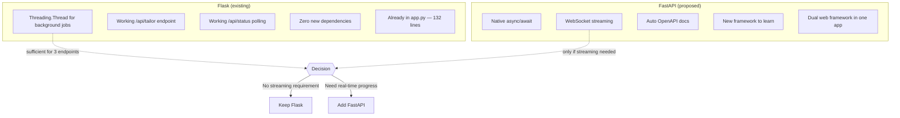

**Why drop FastAPI:**
- The existing Flask server at `app.py:59-64` already handles background jobs via `threading.Thread`
- Status polling via `/api/status/<job_id>` (line 115-119) gives clients progress updates
- FastAPI only wins if you need WebSocket streaming — which a resume tailoring tool doesn't need
- Running two web frameworks in one project adds complexity with zero benefit at this scale

**When to reconsider:** If you add a frontend that needs real-time step-by-step progress (not just polling), FastAPI + WebSocket becomes justified.

---

### 3.2 Database: PostgreSQL vs. SQLite

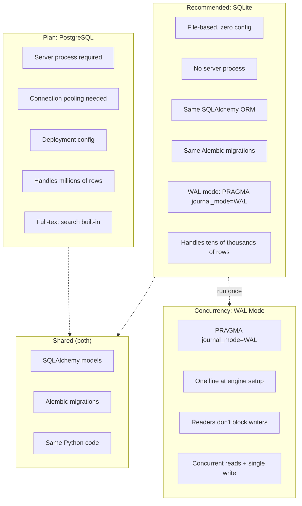

**Data volume estimate for this tool:**
- Profile facts: ~10-50 per user
- JD records: ~5-20 per user per month
- Run logs: ~20-50 per user per month
- Total: **hundreds of rows, not thousands**

**Why SQLite:**
- Zero deployment overhead — no Postgres server to provision, configure, or maintain
- SQLAlchemy models and Alembic migrations work identically with SQLite
- The `sqlite3` module is in Python's standard library
- Single-file database (`knapresume.db`) is trivially backup-able
- The only SQLAlchemy caveat: no `ARRAY` or `JSONB` columns — use `JSON` type instead (which SQLite supports)

**WAL mode — explicit setup step (do not leave implicit):**

```python
# in the SQLAlchemy engine setup (e.g. db.py, before model imports)
engine = create_engine("sqlite:///knapresume.db", connect_args={"check_same_thread": False})

@event.listens_for(engine, "connect")
def _set_sqlite_pragma(dbapi_connection, connection_record):
    cursor = dbapi_connection.cursor()
    cursor.execute("PRAGMA journal_mode=WAL")   # readers don't block writers
    cursor.execute("PRAGMA busy_timeout=5000")   # wait up to 5s on locked DB
    cursor.close()
```

This is a one-line statement (`PRAGMA journal_mode=WAL`) executed once at connection setup. It's required because the app uses Flask worker threads (one job per `threading.Thread`, see `app.py:59-64`) — WAL lets those background threads read the profile while a write is in progress, instead of erroring with `database is locked`. The default `journal_mode=DELETE` rolls back to a hard lock on every write, which will surface as intermittent `sqlite3.OperationalError: database is locked` under concurrent runs.

**When to reconsider:** If you add multi-user support, concurrent writes from multiple processes, or need full-text search beyond what LIKE queries provide.

---

### 3.3 NLP Pipeline: spaCy + KeyBERT vs. KeyBERT Only

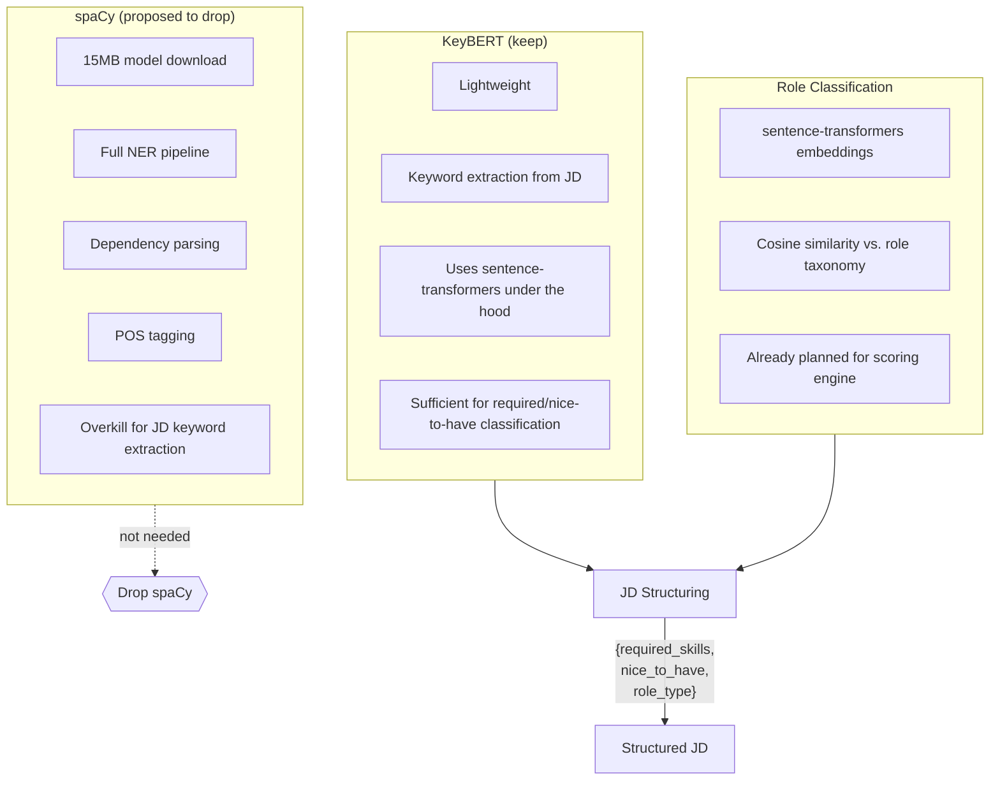

**Why drop spaCy:**
- spaCy's value is NER and dependency parsing — neither is needed for JD structuring
- KeyBERT handles keyword extraction without spaCy's full pipeline
- Role classification can use sentence-transformers embeddings (already in the stack)
- Saves ~15MB download + faster install + fewer version conflicts

**What spaCy would be useful for (but isn't needed here):**
- Extracting company names from free-form text (regex handles this — see `app.py:92-95`)
- Named entity recognition for skills (KeyBERT keyword extraction is more relevant)

---

### 3.4 Verification Engine: Full NLI Cross-Encoder vs. Small NLI Cross-Encoder

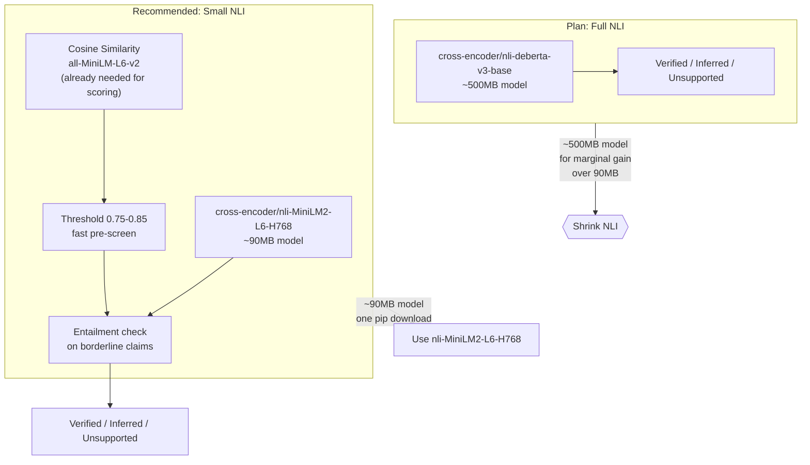

**Why shrink the NLI cross-encoder (instead of dropping it):**
- The full model (`cross-encoder/nli-deberta-v3-base`) is ~500MB and adds minutes to the first-run download
- `cross-encoder/nli-MiniLM2-L6-H768` is ~90MB — a **5.5x smaller** entailment model with the same architecture, built on MiniLM instead of DeBERTa
- Entailment scoring is still available for the third state (**Inferred**), so you don't lose the Verified/Inferred/Unsupported three-state design from the plan
- `all-MiniLM-L6-v2` cosine similarity (already needed for fact-JD scoring) stays as the fast pre-screen — only borderline claims go through the entailment model, keeping runtime low

**Recommended hybrid flow:**

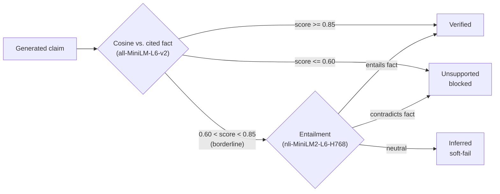

**Why cosine alone is not enough:**
- A paraphrased but fabricated claim can score high cosine similarity to a nearby fact while still being a hallucination
- The 0.75 threshold touted in the plan is heuristic — the small entailment model gives a principled second opinion at the cost of ~90MB, not ~500MB
- Keeping a small NLI model preserves the three-state **Inferred** tag that "cosine only" necessarily collapses away

**When to revisit:** If even the ~90MB model is too heavy for your target runtime, drop entailment entirely and gate on cosine only — then the three-state design collapses to two. But at ~90MB this is unlikely to matter.

---

### 3.5 LLM Abstraction: litellm vs. Existing Dispatcher

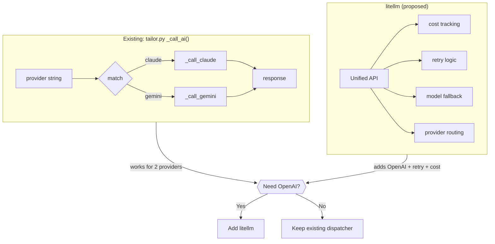

**Decision tree:**
- If Claude + Gemini cover your needs: **keep existing `_call_ai()` dispatcher** — it's 15 lines, clear, and zero dependencies
- If you want OpenAI as a third provider: **add litellm** — it handles the routing, retry, and cost tracking across all three
- If you want retry/rate-limit logic: litellm adds this for free, otherwise implement it manually

**Recommendation:** Add litellm only if you plan to support OpenAI. Otherwise the existing dispatcher is simpler and already working.

---

### 3.6 PDF Export: WeasyPrint vs. ReportLab Only

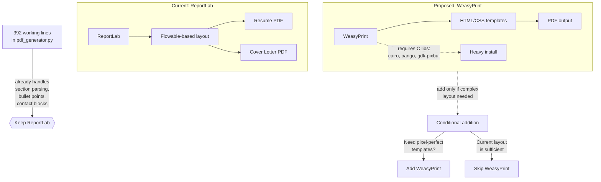

**Why keep ReportLab:**
- Already working — `src/pdf_generator.py` has 392 lines of tested code
- Handles all resume parsing: section headers, bullets, job entries, contact blocks
- Pure Python install — no C library dependencies (cairo, pango)
- WeasyPrint only wins for complex HTML/CSS layouts — resume templates don't need this

**When to reconsider:** If you need pixel-perfect resume templates with complex multi-column layouts that ReportLab's flowable system can't express.

---

## 4. Recommended Architecture (Post-Verification)

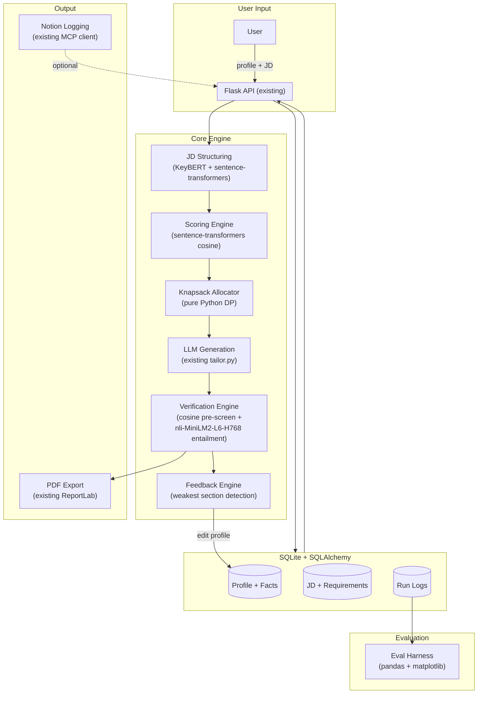

---

## 5. Updated requirements.txt (Recommended)

```txt
# ── Existing (keep) ──────────────────────────────────────────────────────────
anthropic>=0.25.0
google-generativeai>=0.8.0
pypdf>=4.0.0
pdfplumber>=0.10.0
reportlab>=4.0.0
python-docx>=1.1.0
mcp>=1.0.0
notion-client>=2.2.0
requests>=2.31.0
python-dotenv>=1.0.0
rich>=13.7.0
typer>=0.12.0
httpx>=0.27.0
flask>=3.0.0

# ── New (add) ────────────────────────────────────────────────────────────────
SQLAlchemy>=2.0.0
alembic>=1.13.0
keybert>=0.8.0
sentence-transformers>=2.2.0
rapidfuzz>=3.6.0
litellm>=1.30.0          # only if OpenAI support needed; else skip
pandas>=2.1.0
matplotlib>=3.8.0
pytest>=7.4.0
cross-encoder/nli-MiniLM2-L6-H768   # sentence-transformers model (auto-downloaded, ~90MB)
```

**Removed vs. plan:**
- `spacy` + `en_core_web_sm` — not needed; KeyBERT + sentence-transformers covers JD structuring
- `cross-encoder/nli-deberta-v3-base` — replaced with the smaller `cross-encoder/nli-MiniLM2-L6-H768` (~90MB vs ~500MB); you keep the full three-state verification
- `WeasyPrint` — not needed; ReportLab already handles PDF export
- `FastAPI` — not needed; Flask handles existing endpoints
- `psycopg2` / `asyncpg` — not needed; SQLite doesn't require a database driver (and WAL mode is set via one `PRAGMA` line)

**Net install size reduction:** ~615MB (spaCy model: ~15MB, full NLI model: ~500MB replaced by ~90MB small NLI, WeasyPrint C deps: ~200MB)

---

## 6. Migration Path: Existing → Recommended

```mermaid
flowchart LR
    subgraph Phase1["Phase 0-1: Orient + Profile"]
        P0["Fork + run existing app"]
        P1["Add SQLAlchemy models<br/>(Profile, ProfileFact)"]
        P2["Add Alembic migrations"]
        P3["Build CRUD endpoints<br/>(keep Flask)"]
    end

    subgraph Phase2["Phase 2: JD Structuring"]
        P4["Add KeyBERT extraction"]
        P5["Add role classification<br/>(sentence-transformers)"]
        P6["Store JD + Requirements<br/>(SQLite via SQLAlchemy)"]
    end

    subgraph Phase3["Phase 3: Scoring + Allocation"]
        P7["Embedding-based scoring<br/>(sentence-transformers)"]
        P8["Knapsack DP allocator<br/>(pure Python)"]
        P9["Wire before LLM call"]
    end

    subgraph Phase4["Phase 4: Verification"]
        P10["Cosine similarity pre-screen<br/>(reuse scoring embeddings)"]
        P11["Small NLI entailment on borderline<br/>(nli-MiniLM2-L6-H768)"]
        P12["Tag claims Verified/Inferred/Unsupported"]
        P13["Block Unsupported claims"]
        P14["Optionally add litellm"]
    end

    subgraph Phase5["Phase 5-6: Feedback + Eval"]
        P14["Weakest section detection"]
        P15["Re-run endpoint"]
        P16["Eval harness<br/>(pandas + matplotlib)"]
    end

    Phase1 --> Phase2 --> Phase3 --> Phase4 --> Phase5
```

---

## 7. Summary

| Question | Answer |
|---|---|
| Does the plan add unnecessary complexity? | Yes — FastAPI, PostgreSQL, spaCy, the ~500MB full NLI model, and WeasyPrint are overkill for a personal tool |
| Does the plan add unnecessary cost? | Yes — spaCy model (~15MB), full NLI model (~500MB), and WeasyPrint C deps (~200MB) inflate the install by ~700MB; a ~90MB NLI model gets the same verification behavior |
| Is there a better alternative for each dropped item? | Yes — see Section 2.1 table |
| Does the recommended stack still deliver all features? | Yes — profile persistence (SQLite + WAL), JD structuring, scoring, knapsack allocation, three-state verification (small NLI), feedback, and eval are all achievable with the lighter stack |
| When should you revisit dropped items? | If adding multi-user support (Postgres or SQLite connection pooling), complex layouts (WeasyPrint), OpenAI provider (litellm), or if the small NLI model underperforms on paraphrase edge cases (then upgrade to a larger cross-encoder) |
